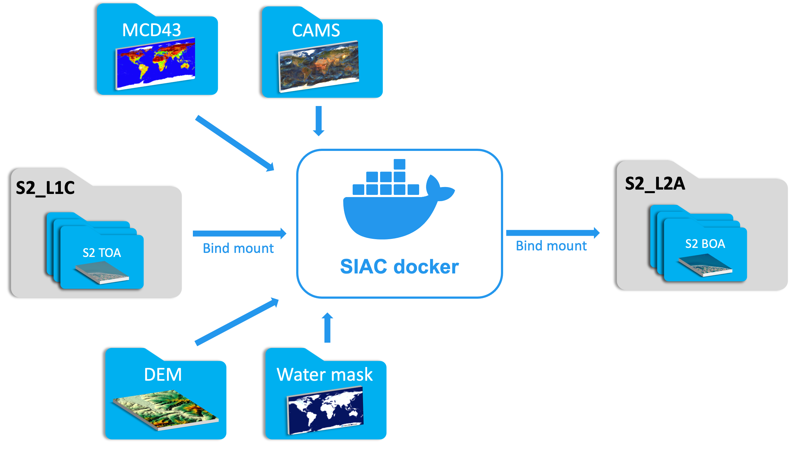

# How to use the SIAC Docker container

## Modified from ChatGPT

### Feng Yin
### Department of Geography, UCL
### ucfafyi@ucl.ac.uk




The [`marcyin/siac`](https://hub.docker.com/r/marcyin/siac) Docker container provides a convenient way to run the [SIAC](https://github.com/marcyin/siac) software on any system that has Docker installed. This can be especially useful if you don't want to install the dependencies required to run SIAC on your local system.

To use the SIAC Docker container, follow these steps:

1. Make sure you have Docker installed on your system. If you don't have Docker, you can [download and install it here](https://www.docker.com/get-started/).

2. Make sure your system has at least 16 GB of RAM and 1 CPU or more. The standard processing time for the SIAC Docker container is 15-30 minutes.

3. Pull the `marcyin/siac` Docker image from Docker Hub by running the following command:
```bash
docker pull marcyin/siac
```


4. Once the image is downloaded, you can run the SIAC Docker container with the default `CMD` of `python run_siac.py` by using the following command:

```bash
docker run --rm --name SIAC marcyin/siac
```

* :warning: :warning: :warning: If you encounter an error message when running the command for the first time, it is likely due to a lack of Google Earth Engine authentication. Please refer to the next section for instructions to [set up Google Earth Engine authentication for Docker](<#Google-Earth-Engine-authentication-for-docker>).

* The `--rm` flag specified in the `docker run` command will automatically delete the container when it's stopped, so you don't have to worry about cleaning up after yourself.
* The `--name` flag allows you to specify a custom name for the Docker container. In this case, we've named it `SIAC`. This can be useful if you need to reference the container by name later on, for example when you want to stop or delete it. 


Alternatively, you can enter the container with a shell by adding the `bash` flag at the end of the `docker run` command:

```bash
docker run --rm --name SIAC -it marcyin/siac bash
```

* This will start the SIAC Docker container and drop you into a shell inside the container. Once you're inside the SIAC Docker container, you can run the SIAC commands as you would normally do. When you're done using the container, you can simply exit the shell to stop the container. 


5. To access the auxiliary data required by SIAC from your host machine, you can use the `-v` flag to bind mount the host directories to the container. For example, to mount the `MCD43`, `DEM`, `water_mask`, `S2_L1C`, and `S2_L2A` directories, you can use the following command:

```bash
docker run --rm --name SIAC \
        -v /path/to/MCD43:/MCD43 \
        -v /path/to/DEM:/DEM \
        -v /path/to/water_mask:/water_mask \
        -v /path/to/S2_L1C:/S2_L1C \
        -v /path/to/S2_L2A:/S2_L2A marcyin/siac
```


* :warning: Replace `/path/to/MCD43`, `/path/to/DEM`, `/path/to/water_mask`, `/path/to/S2_L1C`, and `/path/to/S2_L2A` with the actual paths to the directories on your host system.


## Google Earth Engine authentication for Docker

1. Create a Google Earth Engine account and sign in to [Google Earth Engine](https://earthengine.google.com/).
   
2. Start the SIAC Docker container with the following command:

```bash
docker run --rm --name SIAC -it -v /path/to/earthengine_api_key:/root/.config/earthengine marcyin/siac bash
```

* :warning: Replace `/path/to/earthengine_api_key` with the actual path to the directory on your host system where you want to store the Google Earth Engine authentication key.

3. Once you enter the container, you can run the following command to set up the Google Earth Engine authentication:

```bash
earthengine authenticate --auth_mode=notebook
```
You should see the following message in the terminal:
```console
To authorize access needed by Earth Engine, open the following URL in a web browser and follow the instructions. If the web browser does not start automatically, please manually browse the URL below.
        https://code.earthengine.google.com/client-auth?scopes=https...
The authorization workflow will generate a code, which you should paste in the box below.
Enter verification code:
```

4. Copy the URL to your browser and sign in to your Google Earth Engine account. You will be given a verification code. Copy the verification code and paste it into the terminal. You should see the following message:
```bash
Successfully saved authorization token.
```

5. You can now exit the shell and stop the container by typing `exit` in the terminal. 


This will save the `credentials` under `/path/to/earthengine_api_key` into host machine, which can be reused when starting a new Docker container. To mount the key from the host machine to the container, you can run the SIAC Docker container with the `-v /path/to/earthengine_api_key:/root/.config/earthengine` flag. An example:

```bash
docker run --rm --name SIAC -v /path/to/earthengine_api_key:/root/.config/earthengine marcyin/siac
```
