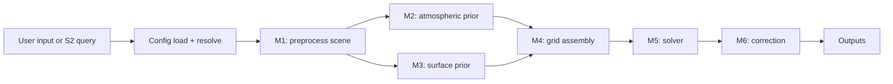

# SIAC

Sensor-Invariant Atmospheric Correction (SIAC) is a modular framework for atmospheric correction of medium-resolution optical satellite imagery. It is designed to turn top-of-atmosphere observations into bottom-of-atmosphere reflectance products with atmospheric diagnostics and uncertainty layers, while keeping the processing flow explicit enough for both operational and scientific use.

SIAC v2 in this repository is organized around:

- a small public Python API and CLI
- a typed TOML-based configuration system
- a staged runtime pipeline with explicit data contracts
- pluggable providers for satellite access, atmospheric priors, BRDF priors, and radiative transfer backends
- Rust-accelerated kernels, PSF, emulator, optimization, and Whittaker smoothing

The scientific reference for the method is:

- Yin, F., Lewis, P. E., and Gomez-Dans, J. L. (2022), [Bayesian atmospheric correction over land: Sentinel-2/MSI and Landsat 8/OLI](https://gmd.copernicus.org/articles/15/7933/2022/)

## Who This Is For

- **Basic users** who need a fast path to install SIAC and run a scene.
- **Scientific users** who need the theory, assumptions, and paper-to-code mapping.
- **Operators and engineers** who need configuration, credentials, cache, runtime, and output details.
- **Developers** who need package boundaries, runtime data flow, and extension points.

## Supported Workflows

- Sentinel-2 as the primary user-facing workflow
- Landsat sensor metadata for catalog and spectral work; end-to-end Landsat
  scene processing is not implemented yet
- Local SAFE input and remote Sentinel-2 resolution/search via configured backends
- Output writing as GeoTIFF, COG, NetCDF, or Zarr

## Core Outputs

- BOA reflectance
- BOA uncertainty, when enabled
- Aerosol optical thickness (AOT)
- Total column water vapour (TCWV)
- Cloud mask
- Quicklook and auxiliary artifacts, depending on output settings

## Fast Install

### Pixi workspace

```bash
pixi install
pixi run bootstrap
pixi run build-rust
```

Pixi is the canonical local setup for SIAC development and validation. It
matches the repository tasks used for linting, type checking, tests, coverage,
and the Rust-backed code paths.

Build the Rust extension before running the full test or coverage tasks in a
fresh environment; the suite imports `siac._rust` during collection.

### Python package

If you are not using Pixi, install the editable package and build the Rust
extension manually:

```bash
python -m pip install -e ".[dev,docs]"
maturin develop --release --manifest-path src/siac_rs/Cargo.toml
```

### Native 6S backend

The repository also includes a native 6SV2.1 backend selected with
`algorithms.rt.backend = "sixs"`.

To build native 6S with the repo-managed toolchain:

```bash
pixi run -e rt6s build-6s-native
```

That environment pins the native-build toolchain to a tested compatibility set:
Python 3.11, `setuptools < 60`, the Fortran compiler, `meson`, and `ninja`.
Inside that environment the Linux smoke workflow now runs
`SIAC_SIXS_F2PY_BACKEND=meson,distutils`, so it validates the Meson backend
first and only falls back to `distutils` if Meson fails. The native builder
generates an explicit F2PY signature for `sixs_f2py_run_batch`, which keeps
the wrapped Python interface limited to the array batch entrypoint instead of
auto-wrapping legacy 6S COMMON blocks. Outside the `rt6s` environment, SIAC
will still try the Meson backend first and only enables `distutils` when NumPy
and `setuptools` support it.
To reproduce the Linux native smoke path locally:

```bash
PYTHONPATH=python pixi run -e rt6s python tools/rt6s_smoke.py
```

See [Native 6SV2.1 Backend](docs/user-guide/native-sixs-backend.md) for setup,
configuration, route selection, outputs, parity validation, benchmark guidance,
and troubleshooting.

## Fast Run

### Canonical developer workflow

```bash
pixi run build-rust
pixi run lint
pixi run format-check
pixi run typecheck-scoped
pixi run rust-test
pixi run test-fast
pixi run test
pixi run coverage
```

Run `pixi run build-rust` after bootstrapping a fresh environment, and rerun it
before the full test or coverage commands when you change the native extension.

### Python API

```python
from siac import SIAC
from siac.config import SIACConfig

config = SIACConfig(sensor="s2")
result = SIAC(config).process("/path/to/S2_SAFE/")

print(result.boa)
print(float(result.aot.mean()))
```

### CLI

For a direct scene run, the CLI entry point is:

```bash
siac process-s2 T31UDQ_20240101 --output-path ./outputs/example
```

## Runtime Flow



## CDSE Sentinel-2 Search and Processing

SIAC can search Sentinel-2 L1C scenes through the Copernicus Data Space
Ecosystem (CDSE), resolve the selected product into the configured local cache,
and process it through the same staged pipeline as local SAFE inputs:

```python
from siac import (
    SIACConfig,
    resolve_s2_input,
    search_sentinel2,
    siac_process_s2,
)

config = SIACConfig(
    sensor="s2",
    providers={"s2": {"backend": "cdse", "cache_dir": "./cdse_s2_data"}},
)

products = search_sentinel2(
    tile="31UDQ",
    start_date="2025-01-01",
    end_date="2025-01-31",
    max_cloud_cover=20,
    backend="cdse",
    config=config,
)

safe_path = resolve_s2_input(products[0].product_id, config)
result = siac_process_s2(
    config,
    safe_path,
    output_path="./outputs/cdse_s2",
    aoi="./aoi.geojson",
)

print(result.boa)
```

Notes:
- CDSE credentials are resolved from `SIACConfig.auth.cdse` and the configured
  environment variables.
- Use `process_sentinel2("/path/to/local.SAFE")` when the SAFE product already
  exists locally.

## Documentation

- Hosted docs: [marcyin.github.io/SIAC](https://marcyin.github.io/SIAC/)
- Documentation portal source: [docs/index.md](docs/index.md)
- Installation guide: [docs/getting-started/installation.md](docs/getting-started/installation.md)
- First run: [docs/getting-started/first-run.md](docs/getting-started/first-run.md)
- Configuration basics: [docs/user-guide/configuration-basics.md](docs/user-guide/configuration-basics.md)
- Native 6SV2.1 backend: [docs/user-guide/native-sixs-backend.md](docs/user-guide/native-sixs-backend.md)
- Running SIAC: [docs/user-guide/running-siac.md](docs/user-guide/running-siac.md)
- Theory: [docs/science/theory.md](docs/science/theory.md)
- Architecture: [docs/architecture/package-map.md](docs/architecture/package-map.md)
- Native 6SV2.1 architecture: [docs/architecture/native-sixs-backend.md](docs/architecture/native-sixs-backend.md)

## GitHub Pages

The repository is set up to build a MkDocs Material site in GitHub Actions and deploy it to GitHub Pages. Repository Pages must be configured to publish from GitHub Actions.

### Local docs workflow

```bash
pixi run docs-serve
pixi run docs-check
```
