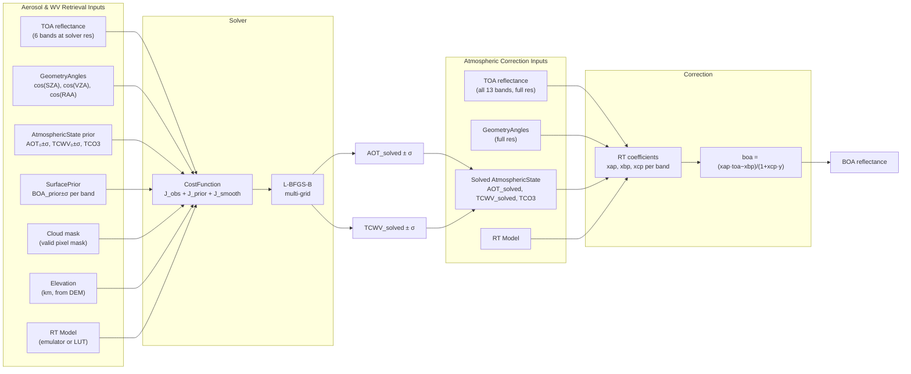
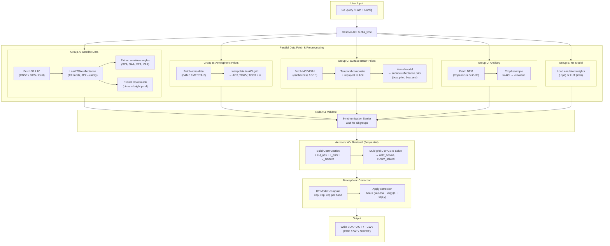

# SIAC v2 - Sensor-Invariant Atmospheric Correction

A modular, extensible framework for atmospheric correction of satellite imagery.

## Features

- **Modular Architecture**: Pluggable components for atmospheric priors, BRDF products, RT models, and sensors
- **Modern Stack**: Built with xarray, rioxarray, Pydantic, and Rust (via PyO3)
- **Extensible**: Easy to add new sensors, data sources, and processing backends
- **Fast**: Rust-accelerated BRDF kernels, PSF convolution, and neural network inference
- **Well-tested**: Comprehensive test suite with unit, integration, and regression tests

## Supported Satellites

- Sentinel-2 A/B (MSI)
- Landsat 8/9 (OLI/OLI-2)
- Extensible to other sensors via LUT or Py6S backends

## Installation

```bash
# From PyPI (when released)
pip install siac

# Development installation
git clone https://github.com/MarcYin/SIAC.git
cd SIAC/siac_v2
pip install -e ".[dev]"

# Build Rust extensions
maturin develop --release
```

## Quick Start

```python
from siac import SIAC
from siac.core.config import SIACConfig

# Load configuration
config = SIACConfig.from_yaml("siac_config.yaml")

# Or use defaults
config = SIACConfig()

# Process Sentinel-2 data
siac = SIAC(config)
result = siac.process("/path/to/S2_SAFE/")

# Access results
print(result.boa)  # BOA reflectance dataset
print(result.aot.mean())  # Mean AOT
```

## Configuration

SIAC uses a hierarchical configuration system. Create a `siac_config.yaml`:

```yaml
sensor: auto  # s2, l8, or auto

atmo_prior:
  provider: cams  # cams, merra2, era5, or user

brdf:
  provider: mcd43  # mcd43, vnp43, mcd19, gee, zarr
  temporal_window: 16

surface_prior:
  method: kernel_model
  psf_sigma_x: 29.75
  psf_sigma_y: 39.0

rt_model:
  backend: emulator  # emulator, lut, or py6s

solver:
  aot_gamma: 10.0
  tcwv_gamma: 5.0
  aerosol_resolution: 1000.0

output:
  format: cog
  include_uncertainty: true
```

## Architecture

```
siac/
├── core/           # Data types, protocols, configuration
├── satellite/      # Sensor-specific preprocessors (S2, L8)
├── priors/
│   ├── atmospheric/  # CAMS, MERRA-2, ERA5 providers
│   ├── brdf/         # MCD43, VNP43, MCD19 providers
│   └── surface/      # Surface prior derivation
├── rt/
│   ├── emulator/     # Neural network emulators (fast)
│   ├── lut/          # Look-up table backend (medium)
│   └── direct/       # Py6S simulation (slow)
├── solver/         # Multi-grid L-BFGS-B optimization
└── correction/     # TOA to BOA conversion
```




				


## Development

```bash
# Install dev dependencies
pip install -e ".[dev]"

# Run tests
pytest tests/ -v

# Run with coverage
pytest tests/ --cov=siac --cov-report=html

# Build Rust extensions
maturin develop --release

# Type checking
mypy python/siac

# Linting
ruff check python/siac
```

## Citation

```bibtex
@article{yin2019sensor,
  title={A sensor-invariant atmospheric correction method: application to Sentinel-2/MSI and Landsat 8/OLI},
  author={Yin, Feng and Lewis, Philip E and Gomez-Dans, Jose and Wu, Qiang},
  journal={EarthArXiv},
  year={2019},
  doi={10.31223/osf.io/ps957}
}
```

## License

AGPL-3.0 - See [LICENSE](LICENSE) for details.
