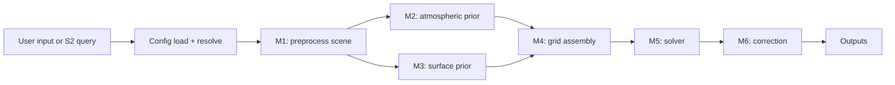

# SIAC

Sensor-Invariant Atmospheric Correction (SIAC) is a modular framework for atmospheric correction of medium-resolution optical satellite imagery. It is designed to turn top-of-atmosphere observations into bottom-of-atmosphere reflectance products with atmospheric diagnostics and uncertainty layers, while keeping the processing flow explicit enough for both operational and scientific use.

SIAC v2 in this repository is organized around:

- a small public Python API and CLI
- a typed TOML-based configuration system
- a staged runtime pipeline with explicit data contracts
- pluggable providers for satellite access, atmospheric priors, BRDF priors, and radiative transfer backends
- Rust-accelerated kernels, PSF, emulator, optimization, and Whittaker smoothing

The scientific reference for the method is:

- Yin, F., Lewis, P. E., and Gomez-Dans, J. L. (2022), [Bayesian atmospheric correction over land: Sentinel-2/MSI and Landsat 8/OLI](https://gmd.copernicus.org/articles/15/7933/2022/)

## Who This Is For

- **Basic users** who need a fast path to install SIAC and run a scene.
- **Scientific users** who need the theory, assumptions, and paper-to-code mapping.
- **Operators and engineers** who need configuration, credentials, cache, runtime, and output details.
- **Developers** who need package boundaries, runtime data flow, and extension points.

## Supported Workflows

- Sentinel-2 as the primary user-facing workflow
- Landsat entry points in the Python API
- Local SAFE input and remote Sentinel-2 resolution/search via configured backends
- Output writing as GeoTIFF, COG, NetCDF, or Zarr

## Core Outputs

- BOA reflectance
- BOA uncertainty, when enabled
- Aerosol optical thickness (AOT)
- Total column water vapour (TCWV)
- Cloud mask
- Quicklook and auxiliary artifacts, depending on output settings

## Fast Install

### Python package

```bash
pip install -e ".[dev,docs]"
maturin develop --release --manifest-path src/siac_rs/Cargo.toml
```

### Pixi workspace

```bash
pixi install
pixi run build-rust
```

## Fast Run

### CLI

```bash
siac process-s2 T31UDQ_20240101 --output-path ./outputs/example
```

### Python

```python
from siac import SIAC
from siac.config import SIACConfig

config = SIACConfig(sensor="s2")
result = SIAC(config).process("/path/to/S2_SAFE/")

print(result.boa)
print(float(result.aot.mean()))
```

## Runtime Flow



## Documentation

- Full documentation portal: [docs/index.md](docs/index.md)
- Installation guide: [docs/getting-started/installation.md](docs/getting-started/installation.md)
- First run: [docs/getting-started/first-run.md](docs/getting-started/first-run.md)
- Configuration basics: [docs/user-guide/configuration-basics.md](docs/user-guide/configuration-basics.md)
- Running SIAC: [docs/user-guide/running-siac.md](docs/user-guide/running-siac.md)
- Theory: [docs/science/theory.md](docs/science/theory.md)
- Architecture: [docs/architecture/package-map.md](docs/architecture/package-map.md)

## GitHub Pages

The repository is set up to build the docs in GitHub Actions and deploy them to GitHub Pages on pushes to `master`. Repository Pages must be configured to publish from GitHub Actions.
