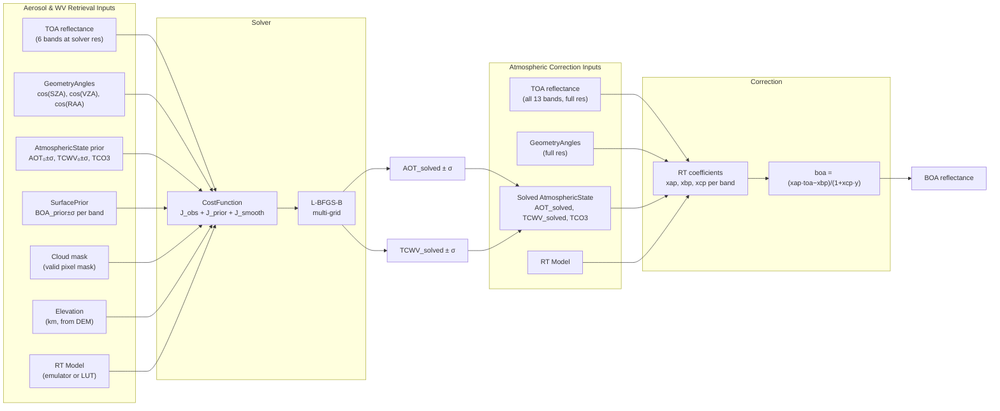
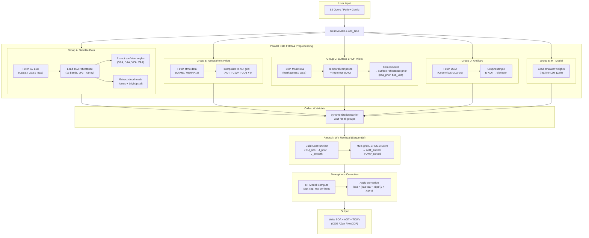

# SIAC v2 - Sensor-Invariant Atmospheric Correction

A modular, extensible framework for atmospheric correction of satellite imagery.

## Features

- **Modular Architecture**: Pluggable components for atmospheric priors, BRDF products, RT models, and sensors
- **Modern Stack**: Built with xarray, rioxarray, Pydantic, and Rust (via PyO3)
- **Extensible**: Easy to add new sensors, data sources, and processing backends
- **Fast**: Rust-accelerated BRDF kernels, PSF convolution, and neural network inference
- **Well-tested**: Comprehensive test suite with unit, integration, and regression tests

## Supported Satellites

- Sentinel-2 A/B (MSI)
- Landsat 8/9 (OLI/OLI-2)
- Extensible to other sensors via LUT or Py6S backends

## Installation

```bash
# From PyPI (when released)
pip install siac

# Development installation
git clone https://github.com/MarcYin/SIAC.git
cd SIAC/siac_v2
pip install -e ".[dev]"

# Build Rust extensions
maturin develop --release
```

Remote-auth can be provided in `config.toml` or via the centralized env overlay:

- Earthdata / earthaccess: `EARTHDATA_USERNAME`, `EARTHDATA_PASSWORD`
- CDS API: `CDSAPI_KEY`
- AWS/S3: `AWS_ACCESS_KEY_ID`, `AWS_SECRET_ACCESS_KEY`
- GCS: `GOOGLE_APPLICATION_CREDENTIALS`
- CDSE: `SIAC_CDSE_USERNAME`, `SIAC_CDSE_PASSWORD`

For CDSE object-store datasets, SIAC can mint temporary S3 credentials from the
same CDSE username/password and use them against `s3://eodata/...`.

## Quick Start

```python
from siac import SIAC
from siac.config import SIACConfig

# Load configuration
config = SIACConfig.from_file("siac.toml")

# Or use defaults
config = SIACConfig()

# Process Sentinel-2 data
siac = SIAC(config)
result = siac.process("/path/to/S2_SAFE/")

# Access results
print(result.boa)  # BOA reflectance dataset
print(result.aot.mean())  # Mean AOT
```

## Full Sentinel-2 Run (Real Data)

Use the helper script to run the full Sentinel-2 workflow (query/download + M1-M6):

```bash
PYTHONPATH=python pixi run python tools/run_full_s2.py \
  --query "S2C_MSIL1C_20260102T024121_N0511_R089_T50QLD_20260102T035433" \
  --backend gcs \
  --cache-dir ~/.cache/siac/s2 \
  --aoi-bbox 119.35 -25.10 119.42 -25.03 \
  --aoi-crs EPSG:4326 \
  --output-dir ./outputs/s2_full_run
```

Notes:
- `--query` accepts a local SAFE path, product ID, or tile-date shorthand (`T31UDQ_20210801`).
- Use `--aoi-bbox` to keep runs tractable on local machines.
- Outputs are written under `output-dir/boa/`, `output-dir/auxiliary/`, plus summary/STAC files from the helper script.

## Configuration

SIAC uses a hierarchical TOML configuration system. Create a `siac_config.toml`:

```toml
[paths]
lut_path = "https://gws-access.jasmin.ac.uk/public/nceo_isp/libradtran_continental_average_lut_1nm.zarr.zip"
spectral_library_root = "/data/siac/spectral-library"
rsrf_root = "/data/siac/RSRF"

[providers.atmo]
kind = "cams"

[providers.brdf]
kind = "mcd43"
temporal_window = 16

[providers.s2]
backend = "cdse"
max_cloud_cover = 40.0

[algorithms.surface_prior]
method = "kernel_model"

[algorithms.rt]
backend = "emulator"

[algorithms.solver]
aot_gamma = 10.0
tcwv_gamma = 5.0
aerosol_resolution = 1000.0

[output.defaults]
format = "cog"
include_uncertainty = true
```

## Architecture

```
siac/
├── api/            # Public entrypoints
├── config/         # System config, TOML loading, resolution
├── catalog/        # Built-in sensor catalog data
├── domain/         # Pure domain types and spectral helpers
├── adapters/       # External systems and backend adapters
├── algorithms/     # Retrieval, correction, RT, cloud, surface logic
├── app/            # Runtime planning and component assembly
├── workflows/      # End-to-end orchestration
├── runtime/        # Xarray-backed execution payloads
├── geo/            # Geometry/reprojection utilities
└── storage/        # Raster and product I/O helpers
```




				


## Development

```bash
# Install dev dependencies
pip install -e ".[dev]"

# Run tests
pytest tests/ -v

# Run with strict coverage gates (global >=95%, each file >90%)
pytest tests/ --cov=siac --cov-report=json:coverage.json --cov-report=xml:coverage.xml --cov-report=html
python tools/check_coverage_thresholds.py --min-total 95 --min-file 90

# Build Rust extensions
maturin develop --release

# Type checking
mypy python/siac

# Linting
ruff check python/siac
```

## Citation

```bibtex
@article{yin2019sensor,
  title={A sensor-invariant atmospheric correction method: application to Sentinel-2/MSI and Landsat 8/OLI},
  author={Yin, Feng and Lewis, Philip E and Gomez-Dans, Jose and Wu, Qiang},
  journal={EarthArXiv},
  year={2019},
  doi={10.31223/osf.io/ps957}
}
```

## License

AGPL-3.0 - See [LICENSE](LICENSE) for details.
