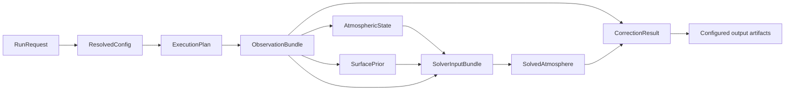
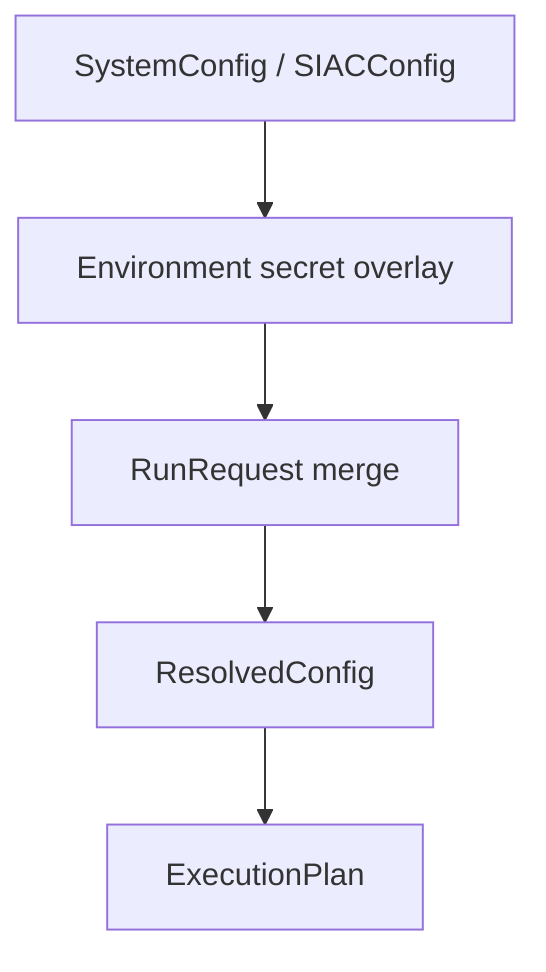

# Data Flow

SIAC keeps runtime data exchange explicit through a small set of typed payloads.
These contracts matter more than any one implementation module because they mark
the handoff points between preprocessing, priors, solver, correction, and
output writing.

## Payload Handoff Diagram

## Core Contract Table

| Contract | Produced by | Consumed by | Key fields |
| --- | --- | --- | --- |
| `RunRequest` | caller-facing config resolution path | `config.resolve` | `input_path`, `output_path`, `sensor`, `aoi`, `s2_query` |
| `ResolvedConfig` | `config.resolve` | `app.planning`, focused assembly modules, workflows | merged paths, auth, providers, algorithms, runtime, output settings |
| `ExecutionPlan` | `app.planning.build_execution_plan` | `workflows.scene.execute_plan` | bound callables plus input/output path, auth, AOI, RT model |
| `ObservationBundle` | preprocessor runtime | atmospheric prior, surface prior, grid assembly, correction | TOA dataset, geometry, cloud mask, sensor config, metadata, CRS, bounds |
| `AtmosphericState` | atmospheric prior provider and solver updates | surface prior, grid assembly, RT model, correction | AOT, TCWV, TCO3, uncertainties, elevation |
| `SurfacePrior` | surface-prior provider | grid assembly | BOA prior, BOA uncertainty, kernel weights, mask |
| `SolverInputBundle` | grid assembler | solver | resampled TOA, geometry, cloud mask, bands, priors, RT model, grid resolutions |
| `SolvedAtmosphere` | solver | correction | solved atmosphere, uncertainties, convergence and cost diagnostics |
| `CorrectionResult` | correction stage | output writer, API caller | BOA dataset, BOA uncertainty, AOT, TCWV, cloud mask, metadata, diagnostics |

## Configuration Data Flow

Configuration has its own lifecycle before any image data is processed:

Important consequences:

- secret values can come from environment variables even when not present in the
  TOML file
- cache paths may be derived from `cache_root`
- per-run fields such as `sensor`, `aoi`, and `s2_query` are applied after the
  system config is loaded

## Sentinel-2 Input Resolution Flow

Before the generic scene path can start, Sentinel-2 inputs may need to be
resolved from a query:

1. Check whether the supplied query is already a local path.
2. If so, return it directly.
3. Otherwise resolve the configured S2 backend.
4. Build a backend-aware `S2Query`.
5. Download or fetch the SAFE product into the configured cache.
6. Pass the resulting local SAFE path into the generic scene workflow.

This is why `process_s2(...)` exists separately from `process_scene(...)`.

## Scientific Data Flow By Stage

| Stage | Spatial scale | Contract focus | Notes |
| --- | --- | --- | --- |
| M1 preprocessing | native sensor resolution | `ObservationBundle` | Captures TOA bands, geometry, cloud mask, and sensor metadata. |
| M2 atmospheric prior | solver resolution | `AtmosphericState` | Prior data are aligned to the retrieval grid, not necessarily the output grid. |
| M3 surface prior | mixed; provider dependent | `SurfacePrior` | Surface priors may depend on spectral mapping, BRDF routes, and optional atmospheric priors. |
| M4 grid assembly | solver grid | `SolverInputBundle` | Normalizes observation and prior data into the solver's working space. Resampling is handled by the canonical functions in `geo.resample`. |
| M5 solver | solver grid | `SolvedAtmosphere` | Produces solved atmospheric variables and uncertainty estimates. |
| M6 correction | output grid | `CorrectionResult` | Uses solved atmosphere to compute BOA outputs and auxiliary layers. Atmospheric fields are resampled to the correction grid via `resample_field_for_correction` from `geo.resample`. |

## Persistence Flow

Output writing does not mutate the runtime contracts. Instead, the configured
output writer translates `CorrectionResult` into artifacts such as:

- BOA rasters
- BOA uncertainty rasters
- auxiliary rasters for AOT, TCWV, and cloud mask
- NetCDF or Zarr containers
- quicklook products when the required bands are present

This keeps the scientific pipeline and persistence layer loosely coupled.
