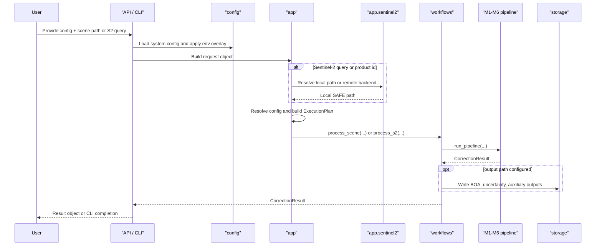

# Execution Flow

This page follows one SIAC run from public entry point to persisted outputs.
The key distinction is that configuration and request resolution happen first,
then the workflow executes the scientific stages M1-M6.

## End-To-End Sequence

## Request Entry Paths

### Generic scene path

Use this route when the input already exists locally and can be treated as a
scene path. Typical entry points:

- `SIAC.process(...)`
- `siac.process_sentinel2(...)`
- `siac.process_landsat8(...)`
- `siac_process(...)`

### Sentinel-2 query path

Use this route when the user passes:

- a local SAFE path
- a Sentinel-2 product ID
- a tile/date shorthand such as `T31UDQ_20240101`

`siac_process_s2(...)` and the CLI `siac process-s2` both take this path. The
workflow first resolves the query to a local SAFE path, then delegates to the
generic scene pipeline.

## Configuration And Planning Flow

Before running the scientific stages, SIAC resolves configuration and binds the
runtime callables:

1. `SIACConfig` or CLI config is loaded.
2. `config.load` applies file loading and environment-secret overlay.
3. `config.resolve` merges system settings with per-run fields such as sensor,
   AOI, input path, output path, or Sentinel-2 query.
4. `app.planning.build_execution_plan(...)` binds:
   - preprocessor
   - atmospheric prior provider
   - surface prior provider
   - grid assembler
   - solver
   - corrector
   - RT model
   - output writer

The result is an `ExecutionPlan`, which is the main boundary between setup and
execution.

## M1-M6 Runtime Stages

| Stage | Main owner | Input | Output | Purpose |
| --- | --- | --- | --- | --- |
| `M1` preprocessing | preprocessor runtime from `app.assembly` | local input path + AOI | `ObservationBundle` | Read TOA data, geometry, cloud mask, metadata, and sensor config. |
| `M2` atmospheric prior | adapter/provider callable | scene bounds, CRS, observation time, solver resolution | `AtmosphericState` | Provide AOT, TCWV, TCO3, uncertainty, elevation priors. |
| `M3` surface prior | algorithm/provider callable | `ObservationBundle`, optional atmospheric prior, RT model | `SurfacePrior` | Build BRDF-derived BOA prior and uncertainty. |
| `M4` grid assembly | `algorithms.grid` | observation + priors + RT model | `SolverInputBundle` | Resample inputs to solver grids and select bands. |
| `M5` solver | `algorithms.solver` | `SolverInputBundle` + config | `SolvedAtmosphere` | Retrieve atmospheric state, uncertainties, and diagnostics. |
| `M6` correction | `algorithms.correction` | observation + solved atmosphere + RT model | `CorrectionResult` | Produce BOA reflectance and auxiliary outputs. |

## Execution Backends

The pipeline supports two execution backends through runtime settings:

- `thread`
- `dask`

The workflow also supports:

- bounded stage retries
- optional stage timeouts
- optional Dask dashboard and performance report paths
- opportunistic LUT scene preloading in parallel with surface-prior work

Those knobs are resolved inside `workflows.pipeline._resolve_execution_settings`
and applied inside `run_pipeline(...)`.

## Output Dispatch

`workflows.scene.process_scene(...)` writes outputs only when both are true:

- the resolved run config contains an output path
- the execution plan includes an output writer

This keeps in-memory API usage and file-writing workflows separate. The output
adapter translates a `CorrectionResult` into raster, NetCDF, or Zarr artifacts
based on the resolved output defaults.

## Developer Reading Order

If you need to trace a real run, read the code in this order:

1. `python/siac/api/public.py`
2. `python/siac/app/sentinel2.py` for S2-specific resolution
3. `python/siac/app/planning.py`
4. `python/siac/app/assembly.py`
5. `python/siac/workflows/scene.py`
6. `python/siac/workflows/pipeline.py`
