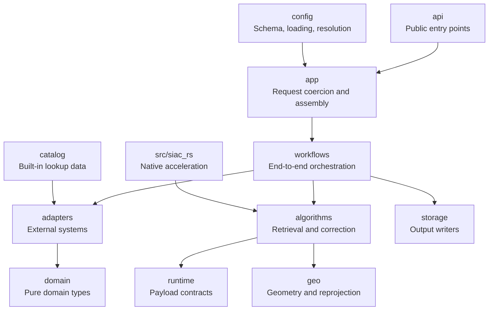

# Package Map

SIAC uses a layered package layout. The public surface is intentionally small,
while the internal packages separate configuration, assembly, orchestration,
external integrations, scientific algorithms, and runtime data contracts.

## Ownership Table

| Package | Owns | Does not own | Notes |
| --- | --- | --- | --- |
| `api` | Stable user-facing entry points such as `SIAC`, `siac_process_s2`, and search helpers | Configuration loading internals, orchestration details, remote backends | Treat this as the canonical public surface. |
| `config` | Typed schema, TOML loading, environment overlays, config resolution, snapshots | Sensor preprocessing, solver math, remote I/O | Converts machine and project settings into a resolved runtime config. |
| `app` | Typed workflow requests, registry lookup, dependency assembly, execution planning, Sentinel-2 query coercion | Numerical algorithms, output persistence | Bridges configuration into runnable callables. |
| `workflows` | End-to-end scene and Sentinel-2 orchestration | Schema validation, file format definitions | Owns stage order, retries, timeouts, and dispatch to output writing. |
| `adapters` | External services, credentials, data-source backends, output adapter assembly, sensor-specific preprocessors | Public API stability, core retrieval math | Isolate remote systems and backend-specific behavior here. |
| `algorithms` | BRDF, cloud masking, RT backends, solver, grid assembly, correction, surface prior logic | Auth, filesystem discovery, CLI parsing | Numerical core of SIAC. |
| `runtime` | Xarray-backed payload types and validators | Config loading, remote access | Provides the typed contracts passed between workflow stages. |
| `domain` | Pure types and protocols such as AOI and sensor definitions | Xarray runtime payloads, auth, config, I/O | Prefer this layer for reusable concepts with minimal side effects. |
| `storage` | Raster/product writers, STAC helpers, readers | Retrieval logic and request parsing | Output and artifact persistence lives here. |
| `geo` | Geometry helpers and reprojection utilities | Product search or config resolution | Shared geospatial utilities used by multiple layers. |
| `catalog` | Bundled sensor catalog and static lookup data | Runtime mutation and remote fetching | Static data only. |
| `src/siac_rs` | Native implementations for kernels, PSF, emulator, optimization, Whittaker smoothing | High-level orchestration and public API | Optional acceleration boundary behind Python interfaces. |

## Stable Mental Model

1. `config` turns user settings into a `ResolvedConfig`.
2. `app` turns that resolved configuration into concrete runtime components.
3. `workflows` execute the M1-M6 processing path.
4. `runtime` carries the typed payloads between stages.
5. `adapters` and `algorithms` do the actual external I/O and scientific work.
6. `storage` persists the result.

## Public And Internal Boundaries

Document these as stable entry points:

- `siac.SIAC`
- `siac.SIACConfig`
- `siac.process_sentinel2`
- `siac.process_landsat8`
- `siac.resolve_s2_input`
- `siac.siac_process_s2`
- `siac.search_sentinel2`
- `siac process-s2`

Everything else should be treated as internal package structure, even when it is
important to developers. Internal modules are still worth documenting, but as
implementation layers rather than compatibility promises.

## Where To Start Reading The Code

- Start at `python/siac/api/public.py` for the public entry points.
- Move to `python/siac/app/planning.py` and `python/siac/app/assembly.py` to see
  how configuration becomes a runnable execution plan.
- Use `python/siac/workflows/scene.py`, `python/siac/workflows/sentinel2.py`,
  and `python/siac/workflows/pipeline.py` for orchestration.
- Use `python/siac/runtime/models.py` for the payload contracts passed between
  stages.
- Dive into `python/siac/adapters/` and `python/siac/algorithms/` once you need
  backend-specific behavior or scientific implementation detail.
