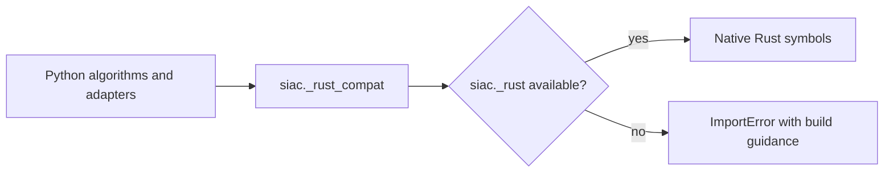

# Rust Integration

SIAC uses an optional Rust extension for a small set of computational hot spots.
The Python package remains the primary architecture; Rust sits underneath it as
an acceleration boundary rather than as a separate application layer.

## What Rust Provides

The native module in `src/siac_rs` exports these capabilities:

- `RossThickLiSparse` for BRDF kernel calculations
- `PSFConvolver` for point-spread convolution and scale matching
- `TwoLayerNN` for the neural-network emulator forward pass and optional Jacobian
- optimization helpers for multi-grid and grid-search workflows
- `whittaker_smooth_cube` for Whittaker smoothing

These exports are registered in `src/siac_rs/src/lib.rs` under the module name
`siac._rust`.

## Python Boundary



The Python package does not import native symbols directly from every caller.
Instead, `python/siac/_rust_compat.py` acts as the compatibility layer:

- tries to import `siac._rust`
- stores the original import error
- exposes proxy classes and helper functions
- raises a targeted `ImportError` when a required native symbol is missing

This pattern keeps import failures readable and makes it obvious how to recover:
build the extension with `pixi run build-rust` or install a wheel that contains
the native module.

## Why This Boundary Matters

Rust is used where performance dominates:

- repeated numerical kernels
- interpolation and grid remapping
- optimization primitives
- neural-network inference
- smoothing operations

Keeping these pieces native allows the rest of the package to stay in Python,
where configuration, orchestration, and xarray-heavy data handling are easier to
maintain.

## Developer Expectations

For most architecture work:

- start in Python
- only drop into `src/siac_rs` when performance-sensitive behavior or native
  symbol exposure matters

For debugging import issues:

1. verify the extension was built
2. import `siac._rust`
3. if import fails, inspect the original error surfaced through
   `_rust_compat.py`

## Build And Test Workflow

Typical local build path:

```bash
pixi run build-rust
```

That task runs the underlying native build command:

```bash
maturin develop --release --manifest-path src/siac_rs/Cargo.toml
```

Use the Pixi task in normal development. Call `maturin` directly only when you
are debugging the native build in a non-Pixi environment.

Relevant validation already exists in CI and tests:

- import smoke checks for `siac._rust`
- wheel install smoke tests
- unit tests around Rust compatibility and algorithm integrations

## When To Extend Rust

Add new native code only when all of these are true:

- the operation is a measurable runtime bottleneck
- the Python implementation is stable enough to preserve behavior during a port
- the boundary can stay narrow and reusable
- the Python API can continue exposing a clean, stable interface

Prefer keeping high-level control flow, request parsing, schema handling, and
storage logic in Python. Use Rust for well-bounded numerical primitives.
