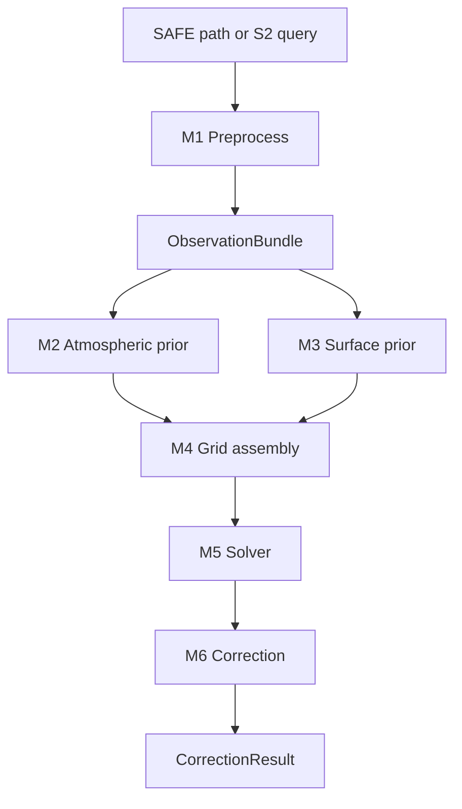

# Overview

SIAC addresses a standard remote-sensing problem: optical satellite sensors measure top-of-atmosphere (TOA) radiance or reflectance, but most land applications need bottom-of-atmosphere (BOA) surface reflectance instead. SIAC combines satellite observations, atmospheric priors, surface priors, geometry, and radiative transfer to estimate atmospheric state and correct the scene.

## What SIAC Produces

- BOA reflectance at scene resolution
- Optional BOA uncertainty layers
- Retrieved atmospheric fields such as AOT and TCWV
- Cloud mask and related auxiliary outputs

## What “Sensor-Invariant” Means

SIAC is designed so the correction logic is not hard-coded to one sensor's exact band set. The public workflows currently emphasize Sentinel-2, but the architecture separates sensor description, preprocessing, spectral mapping, and radiative transfer so that multiple optical sensors can be supported through the same general pipeline.

## The M1-M6 Runtime Stages

| Stage | Purpose | Main output |
| --- | --- | --- |
| M1 | Preprocess raw scene input into a normalized observation bundle | `ObservationBundle` |
| M2 | Fetch or derive atmospheric prior fields | `AtmosphericState` |
| M3 | Derive or fetch surface prior information | `SurfacePrior` |
| M4 | Assemble solver grids at retrieval resolution | `SolverInputBundle` |
| M5 | Solve atmospheric parameters | `SolvedAtmosphere` |
| M6 | Apply atmospheric correction at output resolution | `CorrectionResult` |

## Where To Go Next

- For installation and your first run, continue to [Installation](../getting-started/installation.md) and [First Run](../getting-started/first-run.md).
- For the scientific method, continue to [Theory](../science/theory.md).
- For package boundaries and internal flow, continue to [Package Map](../architecture/package-map.md).
