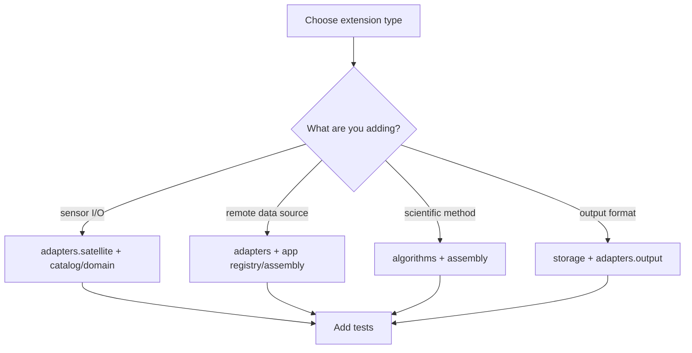

# Extending SIAC

The safest way to extend SIAC is to place new behavior in the layer that
already owns that responsibility. Most extension work falls into one of four
categories:

- new sensor support
- new remote or product backend
- new algorithm or retrieval option
- new output writer or artifact path

## Extension Strategy

## Where New Code Belongs

| Extension type | Primary location | Supporting locations |
| --- | --- | --- |
| new sensor preprocessor | `python/siac/adapters/satellite/` | `catalog/sensors/`, `domain/sensors.py`, tests |
| new atmospheric provider | `python/siac/adapters/atmo/` | `app/registry.py`, `app/_assembly_providers.py`, config schema if new options are needed |
| new BRDF/provider backend | `python/siac/adapters/brdf/` | `app/registry.py`, `app/_assembly_providers.py`, tests |
| new Sentinel-2 backend | `python/siac/adapters/data/` and `python/siac/adapters/s2_backend.py` | `app/s2_backend.py`, tests |
| new RT backend | `python/siac/algorithms/rt/` plus `python/siac/adapters/rt.py` | config schema, tests |
| new surface-prior method | `python/siac/algorithms/surface/` | `app/registry.py`, `app/_assembly_surface.py`, config schema, tests |
| new solver behavior | `python/siac/algorithms/solver/` | `app/_assembly_solver.py`, runtime tests |
| new output behavior | `python/siac/storage/` and `python/siac/adapters/output.py` | config schema, tests |

## Registries And Assembly

The `app` layer is the bridge between configuration and concrete runtime
objects. When you add a pluggable implementation, update both:

- `python/siac/app/registry.py` for named factories
- the focused `python/siac/app/_assembly_*.py` module for selection,
  configuration, and callable binding

Use the existing registries as the standard pattern:

- `ATMO_PROVIDER_REGISTRY`
- `BRDF_PROVIDER_REGISTRY`
- `S2_BACKEND_REGISTRY`
- `SURFACE_PRIOR_METHOD_REGISTRY`

If the new feature is configurable, also extend the schema in
the focused `python/siac/config/` section module so it can be selected through
`SIACConfig`.

## RTModelBackend Protocol

Radiative transfer backends must satisfy the `RTModelBackend` structural
protocol defined in `python/siac/domain/protocols.py`. The protocol declares:

- `simulate_toa(geometry, atmo_state, surface, band)` — forward model
- `compute_coefficients(geometry, atmo_state, bands)` — linearized RT coefficients
- `supported_parameters` — parameter names the backend can vary

Existing backends (`emulator`, `lut`, `sixs`) all implement this protocol.
When adding a new RT backend, ensure it satisfies `RTModelBackend` and passes
an `isinstance` check at solver and corrector initialization.

## Resampling Utilities

All grid resampling between pipeline stages uses the canonical functions in
`python/siac/geo/resample.py`:

- `resample_field_to_template(field, template)` — bilinear resampling with NaN gap-fill
- `resample_mask_to_template(mask, template)` — conservative boolean mask resampling with dilation
- `resample_coefficients_to_template(coeffs, template)` — resamples all `RTCoefficients` fields
- `resample_field_for_correction(field, template)` — resample + guarantee finiteness for correction stage

If you add a new pipeline stage that operates on a different spatial grid,
use these functions rather than implementing ad-hoc resampling.

## Runtime Contract Expectations

New components must fit the payload contracts already used by the workflow:

- preprocessors must produce an `ObservationBundle`
- atmospheric providers must return an `AtmosphericState`
- surface-prior providers must return a `SurfacePrior`
- grid assembly must return a `SolverInputBundle`
- solvers must return a `SolvedAtmosphere`
- correction must return a `CorrectionResult`

If you need a new kind of data handoff, prefer extending the runtime models
explicitly rather than smuggling extra untyped state through dictionaries.

## Sensor Support Checklist

When adding a new sensor:

1. add or update sensor metadata in the catalog/domain layer
2. implement the sensor preprocessor in `adapters.satellite`
3. ensure `detect_sensor(...)` and `get_preprocessor(...)` can resolve it
4. validate band names, geometry handling, and cloud-mask behavior
5. add unit tests and at least one orchestration-path test

## Provider Or Backend Checklist

When adding a new external provider:

1. create the adapter in the correct `adapters/` subpackage
2. isolate credentials and remote calls inside the adapter
3. register or resolve it through the focused assembly module for that stage
4. expose any needed config fields through the schema
5. add tests for auth, query behavior, and failure modes

## Output Extension Checklist

When adding a new output route:

1. keep output materialization in `storage/`
2. keep output selection logic in `adapters/output.py`
3. expose format or option selection in the config schema
4. ensure no-output API usage still works without persistence
5. add tests for produced artifacts and option handling

## Testing Expectations

Every extension should add tests at the closest layer boundary:

- config changes: `tests/unit/test_config.py`, `tests/unit/test_resolve.py`
- registry/assembly changes: orchestration and injection tests
- adapter changes: adapter-specific unit tests
- workflow changes: `tests/unit/test_scene_workflow.py`,
  `tests/unit/test_pipeline_execution.py`, integration tests
- native acceleration changes: Rust compatibility tests and smoke paths

Prefer small, targeted tests first. Add integration coverage when the extension
crosses multiple layers or depends on real backend behavior.
