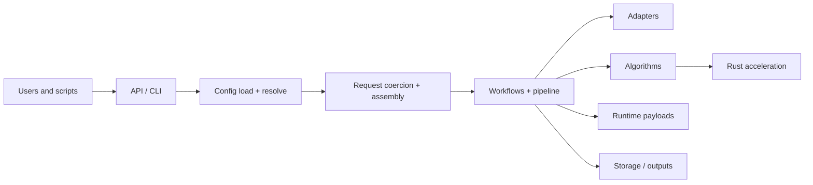

# SIAC Documentation

Sensor-Invariant Atmospheric Correction (SIAC) is a modular framework for atmospheric correction of medium-resolution optical satellite data. The codebase is organized around a compact public API, a typed configuration system, a staged runtime pipeline, and pluggable adapters for data access, priors, radiative transfer, and outputs.

For local development and validation, the repository is Pixi-first: use the
tasks defined in `pixi.toml` for install, lint, type checking, tests, coverage,
and docs.

[Get Started](getting-started/installation.md){ .md-button .md-button--primary }
[Read the Theory](science/theory.md){ .md-button }

Choose the track that matches your job: first run, scientific background, operational setup, or internal extension work.

### First-Time Users
Install SIAC, run a Sentinel-2 scene, and understand the output layout.

[Open Getting Started](getting-started/installation.md)

### Scientific Users
Follow the retrieval logic, priors, and paper-to-code mapping.

[Open Science Docs](science/theory.md)

### Operators
Find configuration, output, and troubleshooting guidance for real runs.

[Open User Guide](user-guide/configuration-basics.md)

### Developers
Trace packages, runtime flow, and extension points inside the repository.

[Open Developer Docs](developer/dev-setup.md)

## Documentation Sections

- [Concepts](concepts/overview.md): overview and glossary for the SIAC domain model.
- [Getting Started](getting-started/installation.md): installation and a first successful run.
- [User Guide](user-guide/configuration-basics.md): runtime configuration, outputs, troubleshooting, the native 6SV2.1 backend guide, and RT model-difference guidance.
- [Science](science/theory.md): retrieval framing, priors, and validation context.
- [Reference](reference/configuration.md): public configuration and API surface.
- [Architecture](architecture/package-map.md): package boundaries, execution flow, data flow, and the native 6SV2.1 backend architecture.
- [Developer](developer/dev-setup.md): local setup and extension guidance.

## Key Operational Guides

- [Native 6SV2.1 Backend](user-guide/native-sixs-backend.md): build, configuration, route selection, outputs, parity validation, benchmarking, and troubleshooting.
- [Configuration Reference](reference/configuration.md): field-by-field public configuration surface, including `algorithms.rt.setup.*` and `algorithms.rt.sixs.*`.
- [Installation](getting-started/installation.md): environment setup, optional extras, and native 6S prerequisites.
