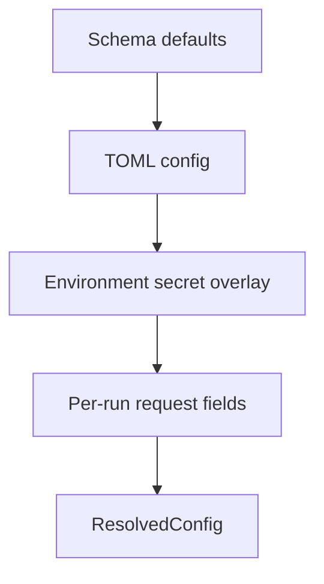

# Configuration Reference

This page documents the public configuration surface driven by `SIACConfig`, `SystemConfig`, and the typed schema in `python/siac/config/schema.py`.

## Precedence model

SIAC resolves configuration in this order:

| Step | Effect |
| --- | --- |
| Built-in defaults | Seed the config with safe schema defaults |
| TOML file | Apply persistent machine or project settings |
| Environment overlay | Fill missing secret/auth fields from environment variables |
| Per-run request fields | Apply `sensor`, `aoi`, `input_path`, `output_path`, and `s2_query` |
| Resolution step | Produce a final `ResolvedConfig` used by assembly and workflows |



## Top-level sections

## `paths`

Controls shared filesystem and remote resource locations.

Key fields:

- `dem`
- `water_mask`
- `emulator_dir`
- `lut_path`
- `spectral_library_root`
- `rsrf_root`
- `cache_root`
- `caches.atmo`
- `caches.brdf`
- `caches.s2`
- `caches.spectral_mapping`

Use `cache_root` when you want SIAC to derive per-subsystem cache directories automatically.

## `auth`

Credentials for:

- `cdse`
- `cds`
- `aws`
- `earthdata`
- `gcs`

Important environment variables:

- `SIAC_CDSE_USERNAME`
- `SIAC_CDSE_PASSWORD`
- `CDSAPI_KEY`
- `AWS_ACCESS_KEY_ID`
- `AWS_SECRET_ACCESS_KEY`
- `EARTHDATA_USERNAME`
- `EARTHDATA_PASSWORD`
- `GOOGLE_APPLICATION_CREDENTIALS`

## `providers`

### `providers.atmo`

Main fields:

- `kind`
- `data_path`
- `cache_dir`
- `download_missing`
- `temporal_interpolation`
- `user_aot`
- `user_tcwv`
- `user_tco3`

Supported kinds include `cams`, `merra2`, `mcd19`, `vnp19`, `era5`, and `user`.

### `providers.brdf`

Main fields:

- `kind`
- `data_path`
- `cache_dir`
- `temporal_window`
- `use_cache`
- `gee_project`
- `zarr_url`

Supported kinds include `mcd43`, `vnp43`, `mcd19`, `gee`, `zarr`, and `user`.

### `providers.s2`

Main fields:

- `backend`
- `cache_dir`
- `max_cloud_cover`
- `prefer_newest_baseline`
- `processing_level`

Supported backends:

- `local`
- `cdse`
- `gcs`

## `algorithms`

### `algorithms.surface_prior`

Main fields:

- `method`
- `psf_sigma_x`
- `psf_sigma_y`
- `apply_psf`
- `whittaker_lambda`
- `spectral_mapping.*`

Supported methods:

- `kernel_model`
- `whittaker`
- `monthly_database`
- `neural`
- `direct`

### `algorithms.rt`

Main fields:

- `backend`
- `lut_interpolation`
- `lut_storage_options`
- `py6s_aero_profile`
- `fallback_to_lut`
- `fallback_to_py6s`

Supported backends:

- `emulator`
- `lut`
- `py6s`

### `algorithms.solver`

Main fields:

- `aot_gamma` — regularization strength for AOT prior term (default `0.05`)
- `tcwv_gamma` — regularization strength for TCWV prior term (default `0.05`)
- `alpha` — band weight power exponent for the observation cost (default `-1.6`). Controls wavelength-dependent weighting: bands are weighted proportionally to $\lambda^{\alpha}$, so negative values give more weight to shorter (aerosol-sensitive) wavelengths. Propagated internally as `MultiGridConfig.band_weight_power` and `CostFunctionConfig.band_weight_power`.
- `max_iterations` — maximum L-BFGS-B iterations per grid level
- `gtol` — gradient tolerance for L-BFGS-B convergence
- `ftol` — function tolerance for L-BFGS-B convergence
- `aerosol_resolution` — target spatial resolution (metres) for the aerosol retrieval grid
- `quadratic_group_size` — group `NxN` solver-grid pixels when computing RT coefficients in the no-Jacobian grid-search path; reduces RT calls but still solves per pixel
- `quadratic_block_size` — solve one shared AOT/TCWV pair for each `NxN` block in the no-Jacobian grid-search path, then broadcast the block solution back to full resolution
- `use_multigrid` — enable the coarse-to-fine multi-grid solver strategy (default `true`)
- `min_grid_size` — minimum grid dimension (pixels) for multi-grid levels
- `bounds.aot` — `[min, max]` bounds for AOT during optimization
- `bounds.tcwv` — `[min, max]` bounds for TCWV during optimization

### `algorithms.cloud_mask`

Main fields:

- `mode`
- `provider`
- `external_mask_path`
- `class_mapping`
- `unmapped_to_missing`
- `target_resolution_m`
- `resolution_policy`
- `allow_upsample_to_target`

## `runtime.execution`

Execution knobs:

- `backend`
- `max_workers`
- `retries`
- `stage_timeout_s`
- `dashboard`
- `dashboard_address`
- `performance_report_path`
- `show_progress`

Supported execution backends:

- `thread`
- `dask`

## `output.defaults`

Controls output persistence.

Main fields:

- `output_dir`
- `format`
- `compression`
- `include_rgb`
- `include_uncertainty`
- `include_auxiliary`
- `boa_dtype`
- `boa_scale`
- `boa_nodata`

Supported formats:

- `geotiff`
- `cog`
- `zarr`
- `netcdf`

## Minimal example

```toml
[providers.s2]
backend = "cdse"
max_cloud_cover = 40.0

[algorithms.rt]
backend = "emulator"

[output.defaults]
format = "cog"
include_uncertainty = true
```

## Practical examples

| Use case | Important settings |
| --- | --- |
| local-only run | `providers.s2.backend = "local"` |
| CDSE-backed Sentinel-2 | `providers.s2.backend = "cdse"` plus CDSE credentials |
| GCS-backed Sentinel-2 | `providers.s2.backend = "gcs"` plus cloud access setup |
| emulator RT | `algorithms.rt.backend = "emulator"` |
| LUT RT | `algorithms.rt.backend = "lut"` plus `paths.lut_path` |
| Whittaker surface prior | `algorithms.surface_prior.method = "whittaker"` |

## Public configuration APIs

- `SIACConfig.from_file(path)`
- `SIACConfig.load(path=None, **overrides)`
- `SIACConfig.with_overrides(...)`
- `SIACConfig.with_env_overlay()`
- `SIACConfig.resolve(RunRequest(...))`

For user-facing narrative guidance, read [Configuration Basics](../user-guide/configuration-basics.md).
