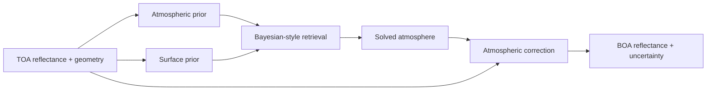

# Theory

SIAC frames atmospheric correction as a constrained estimation problem. The goal is to recover a physically meaningful atmospheric state and then use it to correct top-of-atmosphere observations into bottom-of-atmosphere reflectance.

The scientific baseline for this repository is the 2022 SIAC paper:

- Yin, F., Lewis, P. E., and Gomez-Dans, J. L. (2022), [Bayesian atmospheric correction over land: Sentinel-2/MSI and Landsat 8/OLI](https://gmd.copernicus.org/articles/15/7933/2022/)

## High-level idea

SIAC combines:

- observed TOA reflectance from the scene
- solar and viewing geometry
- atmospheric priors such as AOT and TCWV
- surface priors derived from BRDF products
- a radiative transfer representation through an emulator, LUT, or Py6S backend
- spatial smoothness constraints in the atmospheric retrieval stage

Instead of treating atmospheric correction as a purely forward transform, SIAC treats the atmospheric state as something to be estimated under observation and prior constraints.

## Retrieval then correction

The codebase follows the same broad pattern as the paper:

1. build a normalized observation bundle from the scene
2. estimate or fetch atmospheric priors
3. estimate or fetch a surface prior
4. assemble solver inputs at aerosol retrieval resolution
5. solve for atmospheric state
6. apply correction at the output resolution

## Observation, prior, and smoothness terms

At a conceptual level, the retrieval balances three things:

| Term | Role |
| --- | --- |
| Observation term | Penalizes mismatch between observations and the modeled BOA-to-TOA relationship |
| Prior term | Penalizes departures from prior atmospheric and surface expectations |
| Smoothness term | Encourages spatially coherent atmospheric retrievals at the solver scale |

In the current repository this logic appears across:

- `python/siac/algorithms/grid/assembler.py`
- `python/siac/algorithms/solver/cost.py`
- `python/siac/algorithms/solver/multigrid.py`
- `python/siac/algorithms/correction/atmospheric.py`

## Why coarse retrieval comes before full-resolution correction

The paper emphasizes retrieving atmospheric parameters at a coarser resolution than the native scene bands. The same architectural idea is visible in the code:

- observations are read at scene resolution
- atmospheric and surface priors are assembled onto the solver grid
- the solver retrieves atmospheric state at the configured aerosol resolution
- the solved state is then used to correct BOA at the output grid

This is important because the atmospheric state varies more smoothly than raw TOA observations, and the prior products used for SIAC are often coarser than the scene itself.

## Uncertainty in SIAC

SIAC is designed to carry uncertainty explicitly rather than treat the correction as a black box. The paper treats uncertainty as part of the scientific case for SIAC, and the repository reflects that by carrying uncertainty-bearing fields through runtime payloads such as:

- `AtmosphericState`
- `SurfacePrior`
- `SolvedAtmosphere`
- `CorrectionResult`

The current docs should be read as describing the uncertainty structure present in the codebase, while the paper remains the authoritative scientific explanation for the derivation and validation logic.

## Code-level mapping

| Theory concept | Main code area |
| --- | --- |
| scene normalization | `adapters.satellite`, `runtime.models.ObservationBundle` |
| atmospheric priors | `adapters.atmo` |
| surface priors | `algorithms.surface`, `adapters.brdf` |
| solver grid construction | `algorithms.grid` |
| state retrieval | `algorithms.solver` |
| atmospheric correction | `algorithms.correction`, `adapters.rt`, `algorithms.rt` |

## Reading path

- Continue to [Priors and Mapping](priors-and-mapping.md) for the main scientific building blocks.
- Continue to [Paper Companion](paper-companion.md) for a paper-to-code crosswalk.
