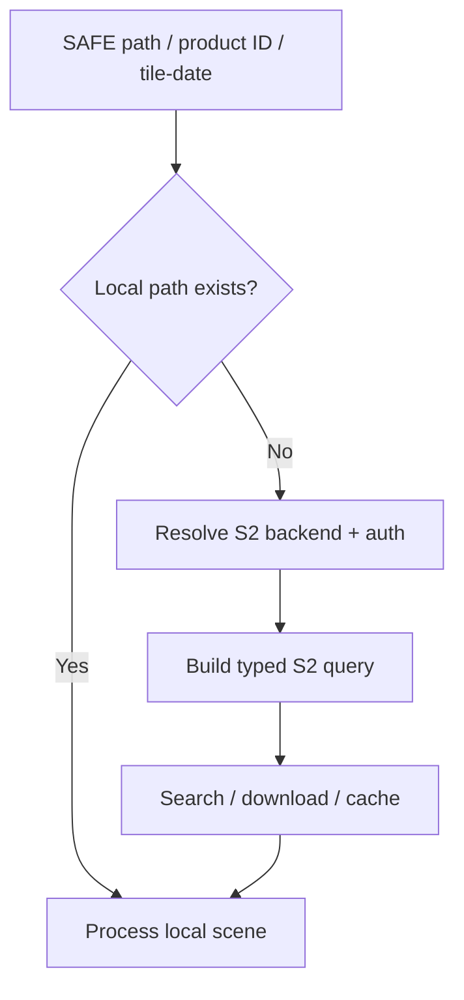

# Running SIAC

The public surface is intentionally small. Most users should stay within the API and CLI entry points listed here.

## Stable public entry points

| Entry point | Audience | Input form | Main result |
| --- | --- | --- | --- |
| `siac.SIAC` | Python users | `SIACConfig` plus local scene input | `CorrectionResult` |
| `siac.SIACConfig` | All Python users | TOML, defaults, or overrides | typed config |
| `siac.siac_process_s2` | Python users | config plus Sentinel-2 query | `CorrectionResult` |
| `siac.search_sentinel2` | Python users | Sentinel-2 search filters | list of products |
| `siac.resolve_s2_input` | Python users | Sentinel-2 query or path | local path |
| `siac process-s2` | CLI users | Sentinel-2 query or path | files on disk plus summary line |

## CLI

The main CLI command today is:

```bash
siac process-s2 QUERY --output-path ./outputs/run
```

Supported `QUERY` forms:

- existing local SAFE path
- full Sentinel-2 product ID
- tile/date shorthand such as `T31UDQ_20240101`

Optional AOI forms:

- `--aoi /path/to/aoi.geojson`
- `--aoi-bbox minx miny maxx maxy`

## Python facade

For local scene processing:

```python
from siac import SIAC
from siac.config import SIACConfig

config = SIACConfig(sensor="s2")
result = SIAC(config).process("/path/to/S2_SAFE/")
```

For query-driven Sentinel-2 processing:

```python
from siac import siac_process_s2
from siac.config import SIACConfig

config = SIACConfig(sensor="s2")
result = siac_process_s2(config, "T31UDQ_20240101", output_path="./outputs/run")
```

## Sentinel-2 query resolution

Sentinel-2 input resolution follows this logic:

1. If the input already exists as a local path, use it directly.
2. Otherwise resolve the runtime config and auth.
3. Build the configured Sentinel-2 backend.
4. Convert the query into a typed `S2Query`.
5. Search or download through the configured backend and cache.
6. Feed the resolved local path into the normal scene pipeline.



## What happens after input resolution

Once a scene path is available, SIAC builds an execution plan and runs the M1-M6 pipeline. The full internal sequence is documented in [Execution Flow](../architecture/execution-flow.md).
