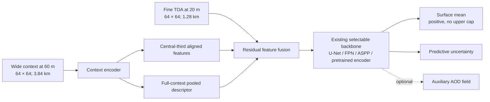

# Expanded, mixed-resolution current-date L1C training

Date: 2026-08-08

## Decision

Expand the surface-prior training archive from the current 152-scene campaign
to a 1,800-scene capture pool, while retaining all 152 existing scenes as a
locked external regression cohort. Train the model with three co-registered
views of the same current-date L1C observation:

- the existing local 60 m tensor;
- a 60 m tensor covering three times the width and height for broad spatial
  context;
- native 20 m red-edge/NIR/SWIR pixels over the local footprint for fine
  spatial structure.

Correction after architecture review: the prediction and historical teacher
are both on the 20 m grid. A centred 60 m tensor with the same array dimensions
provides a three-times-wider spatial field of view. The earlier queued 60 m
teacher/sweep was cancelled on 2026-08-08; its completed index files are kept
only as a 60 m comparison and are not training inputs for this experiment.

## Why the archive must expand

The current cohort is not just small; it misses an important interaction.
Profiling the 149 loadable scenes gave:

| Condition | Current scenes |
|---|---:|
| Surface brightness median at least 0.15 | 22 |
| Surface brightness median at least 0.20 | 9 |
| AOD at least 0.60 | 32 |
| AOD at least 0.60 and brightness at least 0.15 | 4 |
| AOD at least 0.60 and brightness at least 0.20 | **0** |
| Polar geometry | 6 |

Patch weighting cannot synthesize scene-level combinations that do not occur
in the archive. The expansion therefore targets distinct sites and physical
regimes before increasing epochs or model size.

The source catalog has 11,698 acquisitions at 449 sites and 460 tiles. After
excluding every site represented by the locked cohort, 7,221 acquisitions at
303 sites remain. The metadata-only dry run successfully selected all 1,800
requested scenes:

| Split | Scenes | Isolation |
|---|---:|---|
| Train | 1,260 | site-disjoint |
| Development | 270 | site-disjoint |
| Holdout | 270 | site-disjoint |
| Existing campaign | 152 | every one of its 146 sites excluded above |

The selected pool contains 49 scenes in the 0.6–1.0 AOD stratum and 39 at AOD
of at least 1.0. Those are close to the available capacity after enforcing one
scene per site-month; requested quota shares are not falsely reported as
achieved when the source pool cannot support them.

## Leakage contract

AERONET AOD is permitted only for scene sampling and post-training independent
AOD validation. It is prohibited from:

- model inputs;
- surface-prior labels;
- checkpoint selection;
- uncertainty calibration;
- brightness classification;
- capture-quality acceptance.

The surface label remains the RT-consistent, CCI-25%-quantised L1C prior. Stage
B brightness is measured from current-date TOA, not from the teacher. Site is
the grouping key for train/development/holdout assignment. The previous 152
scenes remain external and must not be used for hyperparameter selection.

## Multiscale data contract

For a fine output grid of `H × W` pixels at 20 m:

| Tensor | Bands | Array shape | Ground footprint |
|---|---|---:|---:|
| Fine current TOA | B01-B07, B8A, B11, B12 | `H × W × 10` | `20H × 20W` m |
| Context 60 m | B01, B02, B03, B04, B8A, B11, B12 + validity | `H × W × 8` | `60H × 60W` m |
| Historical L1C teacher/output | B01, B02, B03, B04, B8A, B11, B12 | `H × W × 7` | `20H × 20W` m |

For a 64 × 64 training patch this means:

- fine TOA and teacher footprint: 1.28 km × 1.28 km;
- broad context footprint: 3.84 km × 3.84 km.

The arrays have equal shape but their pixels are not position-for-position
equivalent. The context encoder uses its central third as the coarse view
aligned to the fine target and separately pools the full 60 m tile for broad
context. It does not add a 60 m pixel directly to a 20 m pixel.

Across the frozen 1,800 scenes, this contract exposes 265,420,800 raw 20 m
target positions versus 29,491,200 at 60 m (exactly 9x). Measured input
coverage leaves 264,284,872 versus 29,365,642 valid positions (8.9998x).
With non-overlapping 64x64 patches, the archive contains 64,800 fine patches
instead of 7,200 coarse patches; the train split contains 45,360 instead of
5,040. The number of independent acquisitions remains 1,800 at 303 sites, so
the increase is spatial supervision, not new independent atmospheric states.

## All-era AERONET/Sentinel-2 expansion

The 11,698-row source catalog used above covers only calendar year 2024. A
second metadata-first campaign now searches the full Sentinel-2 era from
2015-06-23 through 2026-07-31. Its sample grain is one unique pair of an
AERONET site and an exact S2A/S2B acquisition; overlapping image crops are not
counted as additional scene samples. AERONET V3 AOD20 must have at least one
measurement within +/-30 minutes. S2C is excluded because the anonymous Google
Cloud archive used for exact windowed L1C reads does not currently support the
selected S2C products.

The catalog runs in three dependent stages:

1. fetch quality-assured historical AERONET observations with one official
   all-sites request per year (12 requests), then partition locally by site;
2. search and pair all sites independently in a 1,665-task Slurm array;
3. merge only when every shard is present, then report exact unique pair,
   product, site, tile, year and AOD-regime counts.

All pairs will be archived, but pair frequency will not define training
frequency: common low-AOD sites must not swamp rare aerosol, geometry,
elevation and land-cover regimes. Existing train/development/holdout site
assignments remain fixed across years, the external 152-scene sites remain
excluded from training, and nearby/co-observed stations require a spatial
leakage group before new sites are assigned.

Teacher construction must also be deduplicated and leakage-safe before bulk
capture. A naive per-pair 20 m realization cube would require several TB and
would repeat nearly identical site/tile/month work. Reuse keys may include
site/grid, tile, calendar month, platform and target-year exclusion. A target
acquisition or target year may never appear in its own historical teacher.
A compact robust median plus uncertainty is sufficient for training; raw
realization cubes need not be duplicated for every pair.

Catalog Slurm jobs submitted on 2026-08-08:

| Job | ID | Role |
|---|---:|---|
| Historical AERONET fetch | 44588302 | AOD20, full S2 era |
| Site-sharded S2 pairing | 44588304 | 1,665 independent sites, no array throttle |
| Exact catalog merge | 44588306 | Runs after every site shard succeeds |

The original AERONET stage made one request per site. AERONET's June 2025
service guidance instead recommends consolidated downloads and explicitly
supports omitting the `site` parameter to return all sites for an entire year.
The replacement bulk stage therefore uses 12 resumable annual AOD20 requests
for 2015--2026, streams each response to disk, and creates the same canonical
per-site files locally. The old files are retained for an exact overlap audit;
they are not overwritten by the bulk acquisition.

The replacement jobs are bulk acquisition **44630950**, cached-catalog rematch
**44630958** (1,665 local site shards in parallel after the CDSE repair), and
bulk-catalog merge **44630959**. The acquisition writes
`bulk_overlap_audit.json`, including common timestamps and exact AOD550 value
agreement with the original per-site archive.

The bulk acquisition completed in 56 minutes: 37,624,998 AOD20 observations
at 835 sites. All 37,623,239 rows at the 834 sites shared with the legacy
per-site archive matched by timestamp and AOD550 (maximum floating-point
difference 1.78e-15), and bulk acquisition found one additional site.

CDSE catalog discovery was then retired. Earth Search's public
`sentinel-2-l1c` STAC collection supplies exact `s2:product_uri` identifiers;
the pixel stage maps those identifiers directly to anonymous
`gs://gcp-public-data-sentinel-2` SAFE prefixes. Live tests covered S2A, S2B
and S2C products in 2024 and 2026 and confirmed every sampled SAFE prefix in
Google Cloud. The old CDSE repair/dependent jobs were cancelled. Replacement
array 44643832 and merge 44643835 were submitted against separate STAC caches;
these IDs were superseded before starting to remove the 80% scene-cloud filter
and retain every AERONET-coincident acquisition. The active unthrottled
1,665-site STAC array is **44643846** and its dependent exact merge is
**44643847**; the query admits 0--100% scene cloud because direct-sun AERONET
already establishes clear sky at the station and global scene cloud should not
discard otherwise usable local samples.

The first STAC array was a deliberate completeness failure, not a catalog:
831 sites without AOD data wrote empty receipts, while all 834 AOD-bearing
tasks failed before network access because the new typed `earth_search` enum
had not been registered at the application backend boundary. This explains
the zero STAC search-cache files and blocked merge. Both the adapter factory
and application registry now have typed-config regression tests, and the real
public `search_sentinel2(..., backend="earth_search")` path returned 12 June
2024 products with exact Google SAFE URLs. Replacement array **44685391**
reuses the 831 valid no-data receipts and reruns the 834 missing searches;
merge **44685394** depends on complete success.

The second STAC attempt proved that the remaining failure was response size,
not rate limiting: 826/834 AOD-bearing searches returned HTTP 502, while the
eight successes had at most 512 products. A representative full-era query
returned 502 with full STAC items even though only 742 matched, but returned
HTTP 200 in 0.62 s when the Fields extension projected only product URI,
baseline, cloud and time. Earth Search now uses projected 500-item pages. The
public SIAC API then returned 664 deduplicated full-era Fowlers Gap products.
Repair array **44689805** reuses 839 complete receipts and searches the 826
missing sites; merge **44689807** follows it.

The next data gate is a 5,000-independent-acquisition capture pool, which
provides up to 180,000 non-overlapping 64x64 native-20 m patches before random
augmentation (36 patches per 384x384 scene). Sites are kept wholly within one
70/15/15 split, the external 152-scene sites remain excluded, and selection is
balanced across AOD, land cover, continent, CCI-25 species, elevation, solar
geometry, season and platform. Per-site and per-site-month caps are 12 and 1.
Dependent jobs are metadata selection **44690374**, exact Google L1C capture
**44690378**, and target-blind structural/diversity audit **44690380**. Teacher
and fine-input jobs will be submitted only after missing or low-coverage
current observations are repaired, avoiding expensive work on rejected rows.

The capture path is now fully CDSE-free as well: adjacent same-datatake tile
discovery was moved from Copernicus STAC to projected Earth Search metadata,
while every raster remains an anonymous Google Cloud windowed read.

The first merge is retained as a failed completeness audit, not as a usable
catalog. It contained only 12,186 pairs at 117 sites because CDSE returned HTTP
429 to 709 sites and the original search helper converted exhausted retries to
an empty result. This was detectable because 834 sites had parsed AERONET data,
the corresponding successful-search cache was absent, and 2024 contained only
1,691 pairs versus the known 11,698-row campaign catalog. Empty transport
failures now fail the shard explicitly. Repair array 44618190 reruns exactly
those 709 sites with ten retries and four concurrent CDSE searches; merge job
44618191 depends on every repair succeeding. The concurrency cap is an
external-service correctness constraint established by the observed 429 rate,
not a compute-throttling choice.

All tensors are read from the exact `product_id` in the manifest. Rasterio
performs windowed reads from the anonymous Google Cloud Sentinel-2 public
bucket. No full JP2 or SAFE is downloaded and no GEE call is made for this
current-observation capture.

## Model flow



The fused context enters the full-resolution 20 m backbone as a learnable
residual with an initial gain of 0.1. This preserves compatibility with the
custom, Sentinel-2-pretrained ResNet, ImageNet, and DOFA encoder/decoder sweep.

Input reflectance is nonnegative with no upper cap. Surface means use a positive
unbounded softplus head because valid bright-target TOA and surface reflectance
can exceed one. The
default robust objective is a heteroscedastic Student-t likelihood with the
teacher uncertainty included, plus spectral-angle and multiscale-gradient
terms. The output is never downsampled; tests assert a full-resolution
prediction from the multiscale inputs.

## Two-stage selection and quality gates

Stage A enriches every candidate with:

- ESA WorldCover land cover;
- Natural Earth continent;
- local CCI aerosol composition quantised in 25% steps;
- AOD stratum for sampling only;
- elevation, season, Sentinel-2 platform, latitude, and estimated solar zenith.

The final catalog has no unknown continents: 1,707 scenes are direct 10 m
Natural Earth polygon hits and 93 coastal/small-island scenes use an audited
nearest-country fallback (maximum angular distance 2.22°). WorldCover maps
1,788 scenes; 12 polar/ocean cells are explicitly marked as not mapped rather
than treated as failed downloads.

Sites are assigned by deterministic capacity-balanced bin packing. This fixes a
failure found in the first dry run: hash-only assignment left the training
partition with capacity for only 1,194 of the required 1,260 scenes.

The first real capture pass exposed a data-source support boundary that was not
visible in catalog metadata: 78 selected S2C products have no SAFE/JP2 objects
in the Google Cloud public Sentinel-2 bucket. Two Aosta scenes also retained
only 49.0–49.8% real same-datatake coverage, below the pre-registered 50% gate.
The repaired catalog keeps all 1,720 other selections and fills exactly 80
vacancies from the unused S2A/S2B pool; it does not lower the gate or substitute
pixels. It retains the same 303 sites and 1,260/270/270 split sizes. Key tails
remain represented (39 extreme-AOD and 71 high-mountain scenes).

Stage B attaches measured values from the current observation:

- visible TOA median, p90, and fraction at or above 0.2;
- mean solar/view zenith and relative azimuth from `MTD_TL.xml`;
- finite-pixel fraction for every local, context and detail band.

Same-datatake neighbouring tiles are mosaicked before coverage is scored. At a
true satellite-swath edge there is no matching observation to invent. These
scenes are retained when at least 50% of each requested grid is observed, and
an explicit all-band validity channel is appended to both model branches before
NaNs are filled. This prevents missing values from masquerading as dark
reflectance. The archive is ready to freeze only if all scenes are present, at
most 2% fail this source-coverage gate, at least 50 bright scenes are present,
at least 10 high-AOD/bright scenes are present, and all three splits remain
represented.
If an interaction gate fails, new candidates are captured; the gate is not
weakened after seeing model results.

## Implemented artifacts

- `experiments/current_date_toa_prior/expanded_sampling.py`: catalog enrichment,
  capacity-balanced site splits, multidimensional quota selection, receipts.
- `experiments/current_date_toa_prior/capture_mixed_resolution_l1c.py`: exact
  product, windowed multiscale L1C capture and geometry receipt.
- `experiments/current_date_toa_prior/audit_expanded_capture.py`: Stage B
  brightness/geometry/integrity audit and freeze gates.
- `experiments/current_date_toa_prior/surface_model_v2.py`: mixed-resolution
  loading, patch extraction, fusion, training, inference, and visual payloads.
- `tools/aeronet_validation/build_l2a_scl_index.py`: GEE-free historical
  winner-index construction. Expanded L1C mode accepts the captured `local60`
  grid directly, ranks days with measured MAIAC AOD, rejects unmeasured days,
  and never inserts an assumed AOD.
- `tools/aeronet_validation/current_date_toa_expanded_catalog.sbatch`: full
  1,800-scene Stage A catalog job.
- `tools/aeronet_validation/capture_l1c_mixed_resolution_all152.sbatch`: 152-way
  unthrottled current-cohort capture.
- `tools/aeronet_validation/current_date_toa_mixed_resolution_pilot.sbatch`:
  five site-grouped out-of-fold mixed-resolution training jobs.
- `tools/aeronet_validation/build_l1c_scl_index_expanded1800.sbatch`: expanded
  historical indices from Planetary Computer SCL, with L1C runtime provenance
  and a shared MAIAC cache.
- `experiments/current_date_toa_prior/build_expanded_l1c_teacher.py`: exact
  historical L1C reads, per-acquisition B8A/B09 CIBR water vapour, CAMS ozone,
  GLO-30 terrain, and native-6S CCI-25 correction on the captured local grid.
- `tools/aeronet_validation/build_expanded_l1c_teacher1800.sbatch`: parallel
  teacher construction with shared Mie and 6S run caches.

## Verification and live jobs

The real-scene smoke test used
`Bambey-ISRA__T28PCB_20240610T113321`. Both added grids had a 1.0 all-band
finite fraction. Its 131 × 163 local grid produced 393 × 489 context and detail
arrays; the detail pixel size was 20 m and the context footprint expanded by
one local-image width/height on each side. The compressed archive was 4.4 MB.

Twenty-eight targeted unit/integration-contract tests pass. They cover deterministic
selection and caps, site-capacity balancing, grid footprints, brightness and
geometry regimes, robust loss behaviour, mixed-input requirements, and exact
full-resolution output shape. They also pin mixed-archive grid ingestion,
month-local low-AOD ranking, and the absence of an AOD fallback when reference
metadata is unavailable.

The final 152-scene validation passed 152/152 archives. Minimum observed
all-band coverage is 0.507 for the wide-context branch and 0.522 for the 20 m
detail branch; both occur at true swath edges and are represented to the model
through validity masks. All five OOF folds began training concurrently after
the validation dependency completed.

Slurm submissions:

| Job | ID | Role |
|---|---:|---|
| Expanded catalog | 44537890 | Final 10 m Natural Earth/WorldCover/CCI enrichment and 1,800-scene selection |
| Initial mixed capture | 44532781 | 152 exact-product captures in parallel; exposed 53 tile-edge context windows |
| Final neighbour/swath repair | 44537886 | same-datatake mosaic plus explicit validity-mask contract |
| Archive validation | 44537887 | checksum, shape and at least 50% real source coverage for all 152 scenes |
| Mixed pilot | 44537888 | five OOF folds, dependent on successful archive validation |
| Pilot merge | 44537889 | merge all 152 OOF predictions, dependent on all folds |
| Expanded multiscale capture | 44537891 | 1,800 current-date local/context/detail captures, dependent on final catalog |
| Expanded capture audit | 44537892 | structural and target-blind diversity gates over all 1,800 scenes |
| Measured-AOD index smoke | 44540917 | one real expanded scene through the new no-GEE/no-assumed-AOD historical-index path |
| CCI-25 teacher smoke | 44541842 | exact L1C/CIBR/CAMS/GLO-30/native-6S teacher, dependent on the index smoke |
| Replacement capture | 44544270 | 80 GCS-supported replacements, unthrottled array |
| Repaired capture audit | 44544271 | final structural/diversity gates over the repaired 1,800-scene manifest |
| Mixed-pilot physical replay | 44545977 | 152-way unchanged M5/6S/CCI-25 AOD replay from the extended-budget mixed OOF surface |

Job 44537892 was cancelled before execution because its old-manifest `afterok`
dependency cannot be satisfied once unsupported S2C tasks correctly fail. It is
superseded by 44544271, which waits for the original array to finish (`afterany`)
and for every replacement to succeed (`afterok`).

The primary comparison is against the previous best seven-band spectral run,
which had visible scene MAE 0.02062 on the same locked cohort. Promotion also
requires inspection by brightness, AOD, land cover, geometry, and continent;
an aggregate improvement alone is insufficient. Operational AOD performance
must still be measured by replaying the unchanged SIAC solver with out-of-fold
surface predictions rather than by treating the optional direct-AOD head as
the production result.

At the latest partial-capture audit, 1,042 repaired-manifest scenes were
available. Of these, 413 met the bright/very-bright rule, 138 were very bright,
44 combined bright surface with AOD of at least 0.6, and none fell below the
50% real-source-coverage gate. These are provisional counts, but they already
clear the registered minimums of 50 bright and 10 high-AOD/bright scenes.

Two mixed-resolution comparisons are retained deliberately. Job 44537888 is
the extended training budget requested for the improved model (140 epochs ×
160 steps, patience 25). Job 44543023 is the strict branch ablation with the
selected spectral baseline's exact 100 × 120 budget and patience 15; its merge
is job 44543024. The first estimates achievable performance and the second
supports causal attribution to the multiscale inputs.

## Mixed-resolution control, physical replay, and expanded release

The schedule-matched five-fold control (job 44543023, merge 44543024) records
visible scene MAE 0.02079, versus 0.02062 for the selected seven-band spectral
baseline (+0.85%). The extended 140-epoch/160-step run records 0.01976
(-4.16%). Consequently, the pilot does not show that the extra branches improve
the result under a fixed optimization budget; it shows that the mixed model can
use them when trained for longer. This distinction is retained in the report.

The unchanged M5/6S/CCI-25 physical replay of the extended mixed OOF surface
completed for all 152 scenes. On the frozen 149 valid AERONET denominator it
scores 108/149 (72.5%) within expected error, MAE 0.1015 and RMSE 0.1865. The
selected spectral baseline scores 109/149 (73.2%), MAE 0.1058 and RMSE 0.2039.
Thus mixed resolution improves continuous AOD error but loses one threshold
hit; it is not promoted. The paired transitions are 99 hit→hit, 10 hit→miss,
9 miss→hit and 31 miss→miss; the site-grouped bootstrap 95% interval for the
within-EE change is [-7.0, +3.8] percentage points. In the high-AOD stratum it
scores 12/32, which is the main reason the expanded aerosol/brightness sampling
is required.

The full capture audit found eight additional deterministic source failures
after the initial 80-product GCS repair: five true swath-edge windows below the
registered 50% support gate and three products with absent public-bucket bands.
They were replaced without changing the gate. A ninth replacement was itself
49.87% supported and was replaced in a final catalog revision. The final
`catalog_gcs_ab_repair3` still has 1,800 scenes, 303 sites and exactly
1,260/270/270 site-disjoint train/development/holdout scenes. All nine failed
matchups remain explicitly excluded so a later repair cannot silently
reintroduce them.

The measured-AOD index and native-6S teacher smoke tests passed on Madrid. The
teacher produced 18 May/June/July historical realizations in 545.2 s, with
minimum per-realization finite fraction 0.99646, shared CCI-25 Mie/run caches,
L1C B8A/B09 CIBR water vapour, CAMS ozone and GLO-30 terrain. A real loader
smoke then produced a 128 x 128 x 7 local input/target, 384 x 384 x 8 context
tensor and 384 x 384 x 7 native-detail tensor. It also caught and fixed an
explicit schema mapping from semantic teacher bands (`coastal`, `blue`, ...)
to Sentinel-2 IDs rather than relying on array position.

`train_expanded_multiscale.py` now trains against the frozen site splits. It
does not load AERONET columns, disables the direct-AOD loss because there is no
leakage-safe expanded AOD label, and retains the Student-t surface likelihood.
The expanded sweep also enables an opt-in pooled token from the complete
11.52 km context view alongside the scale-normalised context feature map and
the geographically aligned 20 m detail encoder. The flag defaults off so the
completed 152-scene ablations remain exactly reproducible.
The submitted 12-arm sweep covers custom, Sentinel-2 ResNet-18, ImageNet
ResNet-18 and DOFA encoders with U-Net, FPN and ASPP decoders; non-custom
encoders use the existing pretrained weights and all encoders are fully
fine-tuned.

The final unthrottled dependency chain is:

| Job | ID | Role |
|---|---:|---|
| Last one-scene capture replacement | 44553571 | replace the deterministic 49.87% swath-edge scene |
| Final 1,800-scene structural/diversity audit | 44553572 | enforce source support and registered diversity gates |
| Historical measured-AOD indices | 44553573 | 1,800-way no-GEE L2A-SCL provenance plus exact-L1C runtime source |
| Native-6S CCI-25 teachers | 44553574 | 1,800-way historical surface-prior construction with shared caches |
| Expanded architecture sweep | 44554791 | 12 parallel mixed-resolution train/development/holdout models with pooled wide-context token |

The final audit job 44553572 completed successfully: 1,800/1,800 scenes were
validated with zero missing or rejected scenes, and `ready_to_freeze=true`.
Minimum all-band finite fractions are 0.5079 local, 0.5025 wide context and
0.5063 native detail. The archive contains 485 bright plus 232 very-bright
scenes, 60 high-AOD/bright scenes, 71 high-mountain scenes, and all registered
land-cover, continent, aerosol-species and geometry regimes. Job 44553573 has
therefore been released to the scheduler; its priority state is queueing, not a
failed dependency.

The first pending sweep submission, 44553575, was cancelled before any task
ran because Slurm had snapshotted the script before the pooled-context flag was
added. Job 44554791 is its exact replacement and depends on the same teacher
array.

The reviewed public report, including fixed-stretch inputs, surface examples,
band scatter plots, fold/training diagnostics, expanded-cohort distributions
and physical AOD replay, is published at
<https://gws-access.jasmin.ac.uk/public/nceo_isp/siac_refactor/reports/current-date-toa-surface-v2-20260808/>.
The packaged artifact and semantic fallback passed validation and structural
verification. Automated desktop/mobile interaction verification was not run
because the installed Chromium 140 dump-DOM runtime starved the embedded
reader's animation-frame startup under virtual time; the public endpoint was
independently checked to return HTTP 200.

### Extended-budget pilot result

The five-fold run and merge completed successfully in 24 minutes 52 seconds
wall time (all folds ran concurrently). Compared with the selected seven-band
spectral model on the same 152-scene locked cohort:

| Metric | Spectral baseline | Mixed resolution | Change |
|---|---:|---:|---:|
| Visible scene MAE | 0.02062 | 0.01976 | -4.16% |
| Median scene MAE, B02 | 0.01201 | 0.01054 | -12.2% |
| Median scene MAE, B03 | 0.01313 | 0.01132 | -13.8% |
| Median scene MAE, B04 | 0.01511 | 0.01339 | -11.4% |
| Pixel MAE, B02 | 0.01610 | 0.01458 | -9.4% |
| Pixel MAE, B03 | 0.01780 | 0.01497 | -15.9% |
| Pixel MAE, B04 | 0.02002 | 0.01676 | -16.3% |
| Median inference time per scene | 0.0321 s | 0.0316 s | effectively unchanged |
| Parameters | 2,104,972 | 2,128,436 | +1.1% |

Three folds improve scene MAE by 8.3%, 15.4%, and 22.5%; fold 4 improves by
12.5%, while fold 3 regresses by 24.3%. The regression is concentrated in one
transient-snow scene, `Barrow__T04WEE_20240509T223531`: its target visible
reflectance median is about 0.90, the spectral model predicts about 0.76, and
the mixed model predicts about 0.58. This one scene adds 0.185 reflectance MAE
and explains nearly the entire fold-level gap. It remains in all official
metrics. The repaired expanded archive and Stage B brightness audit are the
planned correction: the present 149-loadable-scene cohort has only one example
at this brightness, so optimization cannot learn that interaction reliably.

## All-era public-STAC campaign (2026-08-09)

The complete official AERONET annual bulk archive was matched to Earth Search
Sentinel-2 L1C metadata and anonymous Google Cloud SAFE objects. The validated
catalogue has 118,140 unique matchups from 738 sites and 107,962 exact products:
56,277 S2A, 57,150 S2B and 4,713 S2C. All 1,665 historical site tasks have an
explicit successful receipt; 834 sites had bulk AERONET input and 738 produced
at least one ±30-minute satellite matchup. Completeness gates of 100,000 rows,
700 sites and 11,698 rows in 2024 all pass (2024 observed: 14,684).

The selector excludes every site in the locked 152-scene AOD cohort before
assigning complete sites to train/development/holdout. It froze 5,000 scenes
and 592 sites as 3,500/750/750 scenes and 416/88/88 sites. The cap is 12 scenes
per site and one scene per site/year-month. Selected stress coverage includes
477 AOD≥1 scenes, 599 AOD 0.6–1 scenes, 1,521 built-up scenes, 340 bare/sparse
scenes, 200 sites/scenes above 2,500 m, 485 S2C scenes and nearly equal seasonal
quarters. AERONET values are used only for this sampling audit and are absent
from model inputs, teacher labels, losses, uncertainty calibration and model
selection.

WorldCover enrichment was changed from one remote 25-point neighbourhood per
matchup to one per unique site (118,140 → 738 lookups), and CCI species lookup
is cached per site/month. This reduced the completed selection stage to 75 s.
The locked cohort's missing B01–B04 native-detail inputs were separately
captured 152/152 from public Google Cloud. Model inference remains native 20 m;
its B02/B03/B04 output is aggregated by exact aligned 3×3 area means onto the
existing 60 m M5 template. Shape, origin, resolution and CRS are asserted before
replay, and uncertainty is conservatively area-averaged without an independent-
pixel √9 reduction.

Current dependency chain:

| Job | ID | Role |
|---|---:|---|
| Missing-only STAC repair | 44691542 | 502 genuinely absent site shards; completed |
| Validated catalogue merge | 44691543 | all completeness gates; completed |
| Leakage-safe 5,000 selection | 44691544 | metadata enrichment and frozen split; completed |
| Public-GCS mixed L1C capture | 44691545 | 5,000 exact-product windowed captures |
| Capture/diversity audit | 44691546 | structural and target-blind Stage-B gate |
| Native visible fine capture | 44693126 | B01–B04 on accepted 20 m grids |
| Historical SCL/MAIAC index | 44693127 | public STAC/L2A SCL index with exact-L1C runtime values |
| Native-6S CCI-25 teacher | 44693128 | 5,000 scene teachers with shared Mie/run caches |
| Training-input audit | 44693129 | schemas, grid identity, finite teachers and site isolation |
| Twelve-arm model sweep | 44693130 | custom/S2-ResNet/ImageNet-ResNet/DOFA × U-Net/FPN/ASPP |
| Development-only selection | 44693169 | freeze primary and three family-diverse replay candidates |
| Locked-cohort inference | 44693170 | 3 × 152 native-20 m predictions and exact 60 m aggregation |
| Unchanged M5 replay | 44693171 | 3 × 152 public-model surface priors through 39-node M5 |
| AOD scoring | 44693172 | 149-valid-case EE, errors, regimes and paired bootstrap |

The twelve training arms use full fine-tuning, 64×64 20 m patches, the full
60 m context summary, Student-t likelihood (df=3), 2% synthetic sparse teacher
contamination and early stopping. The primary checkpoint is selected only by
the development surface selection score. Holdout surface results and locked
AERONET AOD are disclosure/pass-fail evaluations and cannot change that choice.

## Optimal-M5 teacher correction (2026-08-12)

The first 5,000-scene optimal-M5 capture used the default OCM mapping, which
merged native thin cloud with thick cloud, and the audit rejected an entire
scene if any supported surface value exceeded one. Both rules were wrong for
this experiment. Teacher schema `siac_optimal_m5_teacher_v2` now preserves the
native OCM classes (0 clear, 1 thick cloud, 2 thin cloud, 3 shadow), retains
clear and thin-cloud pixels, and masks only thick cloud, shadow, missing input,
non-finite/negative surface, or invalid AOD pixels. The audit accepts a scene
whenever at least 1,024 trainable pixels remain; there is no surface upper
bound. This preserves the intended test of whether NIR/SWIR anchors can recover
surface information under thin cloud.

Replaying the corrected pixel rule over the 213 former `surface_range`
rejections shows that all 213 retain at least 1,024 trainable pixels. It masks
42,873 pixels containing a negative band while retaining 415,102 pixels with a
band above one; the maximum retained teacher reflectance is 2.9187. In the
first 62 regenerated real scenes, 422,545 OCM thin-cloud pixels were retained,
414,736 reached the final teacher mask, and zero thick-cloud or shadow pixels
leaked into the labels.

The matching model keeps TOA inputs nonnegative without an upper cap, removes
target clipping, and uses an unbounded positive softplus surface head. Student-t training remains the
robust protection against sparse teacher errors. Surface pixels above one also
have an explicit balanced-sampling stratum, so their numerical acceptance is
matched by a realistic chance of entering training patches. The slow DOFA arms were
removed after they failed to improve the earlier comparable models. The new
factorial sweep covers custom, Sentinel-2-pretrained ResNet-18 and
ImageNet-pretrained ResNet-18 encoders with U-Net, FPN and ASPP decoders.

The superseded three-arm run (job 45316639) was cancelled after 19 custom
U-Net, 20 ImageNet-ResNet U-Net and two DOFA U-Net epochs so it could not train
further on obsolete labels. Its best observed development scene MAE values
were 0.02094, 0.02245 and 0.02448 respectively; DOFA required about 35 minutes
per epoch versus about 5–6 minutes for the other two and provided no observed
gain. These are diagnostic partial-run values, not final holdout comparisons.

| Job | ID | Role |
|---|---:|---|
| Pixel-range real-data pilot | 45349720 | Arcata label with sparse negative retrieval artefacts |
| Unthrottled optimal-M5 v2 capture | 45349724 | remaining 4,999 scenes; scheduler fills all allowed CPU slots |
| Pixel-level teacher audit | 45349725 | dependent frozen thin-cloud-aware manifest |
| Nine-arm non-DOFA sweep | 45349726 | dependent custom/S2-ResNet/ImageNet × U-Net/FPN/ASPP |

### Uncapped current-date TOA correction

The source capture itself was subsequently found to hard-clip every public-GCS
L1C band to `[0, 1]`, so changing only model preparation would not recover the
lost bright-target signal. The first uncapped pass regenerated mixed and fine
archives as `siac_l1c_mixed_resolution_v2` and
`siac_l1c_fine20_visible_v2`: it applied a processing-baseline heuristic,
floored negative finite values to zero, and imposed no upper bound. That pass
proved the clipping problem but is superseded by the exact-metadata schema-v3
capture below. Model patch tensors, wide context, pooled context, synthetic
TOA, and locked-cohort inference all use the same nonnegative, unbounded
contract.

The capped teacher chain 45349724–45349726 was cancelled before training; its
partial v2 teacher outputs are retained only as superseded diagnostics.

The Davos public-JP2 pilot previously contained 125,560 detail, 136,353 context,
and 98,876 fine values pinned to exactly one. Its regenerated mixed archive
preserves 275,908 values above one, with local/context/detail maxima of 2.0198,
2.0836 and 2.2220 respectively.

| Job | ID | Role |
|---|---:|---|
| Davos mixed pilot | 45370553 | prove public-JP2 values above one survive conversion |
| Davos fine pilot | 45370554 | prove visible 20 m values above one survive conversion |
| Remaining mixed recapture | 45370576 | 4,999-way public-GCS windowed capture |
| Remaining fine recapture | 45370577 | per-scene `aftercorr` B01–B04 capture |
| Uncapped-input audit | 45371066 | schema/alignment/support gate plus exact old=`min(new,1)` proof |
| Optimal-M5 v3 teacher | 45371067 | thin-cloud-aware teacher using uncapped TOA |
| Teacher audit | 45371068 | pixel-level support and range audit |
| Nine-arm non-DOFA sweep | 45371069 | custom/S2-ResNet/ImageNet × U-Net/FPN/ASPP |

### Exact Google SAFE radiometric calibration

The uncapped pilot still inferred L1C calibration from the product processing
baseline: pre-PB04 used `(DN - 0) / 10000` and PB04+ used
`(DN - 1000) / 10000`. Those values match the sampled ESA products, but the
heuristic is not an adequate archive contract. The committed live L1C surface
library and the current-date capture now share one metadata reader. For every
exact Google Cloud SAFE it downloads the small product-level
`MTD_MSIL1C.xml`, verifies `PRODUCT_URI` and `PROCESSING_BASELINE` against the
selected SAFE, and applies independently per band:

`TOA = (DN + RADIO_ADD_OFFSET[band]) / QUANTIFICATION_VALUE`.

Pre-PB04 metadata legitimately omit `RADIO_ADD_OFFSET` and are represented as
zero offsets. PB04+ products must carry a complete 13-band offset table; a
missing quantification value, incomplete offsets, unknown band id, product
mismatch, or baseline mismatch rejects that acquisition rather than silently
biasing the monthly surface mosaic. Metadata are cached per SAFE, so the
production B01–B12 surface-prior read and the B8A/B09 CIBR water-vapour read do
not repeatedly fetch XML. Captures record the metadata object, SHA-256,
quantification value, per-band offset, and formula in schema-v3 receipts.

Checks against real Google products established PB 02.04 as Q=10000/offset=0,
PB 04.00 as Q=10000/offset=-1000, and PB 05.10 as
Q=10000/offset=-1000. Regression fixtures deliberately use Q=20000 and
different offsets by band, proving the implementation reads metadata rather
than reproducing those observed constants. The heuristic recapture chain
45370576–45371069 was cancelled. Independent pre-/post-PB04 schema-v3 capture
pilots are jobs 45374693–45374694; full capture, teacher-v4, audit, and training
use separate `*_metadata_uncapped` roots. Both pilots passed: the pre-PB04
Davos archive has 374,771 fine/detail/context/local values above one and a
maximum of 2.222, while the post-PB04 AAQ10 archive remains below one; both
metadata-derived archives equal the heuristic uncapped arrays bit-for-bit and
their capped references equal `min(new, 1)`.

| Job | ID | Role |
|---|---:|---|
| Exact-metadata mixed capture | 45375569 | unthrottled 5,000-scene public-GCS array |
| Exact-metadata fine capture | 45375570 | per-index `aftercorr` B01–B04 capture |
| Input archive audit | 45375571 | schema, metadata SHA, formula, grids, support and cap comparison |
| Optimal-M5 teacher v4 | 45375572 | thin-cloud-aware labels from metadata-calibrated current TOA |
| Teacher audit | 45375573 | pixel support/range gate and frozen manifest |
| Nine-arm training sweep | 45375574 | custom/S2-ResNet/ImageNet × U-Net/FPN/ASPP |

## Surface-error decomposition and the four resulting changes (2026-08-28)

The reported ~0.011 development surface MAE is not a single ceiling. Decomposing
the best current arm (`conditioned_input_residual_pcgrad_seed20260825`, 346
development scenes, AERONET-conditioned target) gives:

| Component | MAE | Share |
|---|---:|---:|
| As reported | 0.01095 | — |
| Minus one scalar offset per scene per band | 0.00714 | 34.7% |
| Minus a per-scene affine (offset + gain) | 0.00623 | 43.1% |

The offset and the gain are the two coefficients of the same 6S correction
(`runtime/models.py:347-351`): `y = xap*toa - xbp` makes `xbp` the path-radiance
offset and `xap` the transmittance gain. Their ~4:1 error ratio is what the
physics predicts for the visible. The slope is a genuine per-scene gain error,
not regression attenuation: its distribution is symmetric about one
(median 0.9888, IQR 0.908-1.058).

Three candidate causes were tested and two were falsified:

- **Teacher AOD error is not the driver.** Scene offset versus teacher AOD error
  gives r = +0.206, R² = 0.042. The conditioned teacher is inverted at *measured*
  AERONET AOD, so its AOD error is ~0 by construction, and the offset survives at
  nearly full magnitude (`corr(offset, AERONET AOD) = +0.037`).
- **Resolution is not the driver.** Scoring the same predictions at 60 m removes
  only 5.4% of the error and at 180 m only 11.1%. The residual is low-frequency.
- **The offset is a persistent per-site level bias.** 68.8% of its variance is
  between sites (ICC 0.627), up from 31.5% in the 2026-08-19 run whose
  within-site component was still unlearned. Examples: El_Farafra mean offset
  -0.0562 with a within-site sd of 0.0080; LAMTO-STATION -0.0159 with sd 0.0010.
  These are constants, not noise. Since the splits are site-disjoint, that
  component cannot transfer.

The bias tracks brightness: `corr(site offset, site brightness) = -0.488`, with
`site_offset ~ +0.0065 - 0.0657 * brightness` (R² = 0.238). The model
under-predicts bright sites by roughly 6.6% of their brightness — shrinkage of an
under-represented stratum, not an information limit.

The error is also two regimes rather than one. Seven of eight scene-brightness
octiles sit at 0.005-0.009 MAE; the brightest octile sits at 0.0157. The darkest
quartile median is 0.00559 against the teacher's own 0.006 sigma floor, whose
MAE-equivalent is 0.0048 — the model has converged onto the label noise floor
there. The worst 5% of scenes carry 27.6% of all error and the worst 20% carry
49.6%.

Finally, the teacher's declared uncertainty does scale with reflectance
(r = +0.646) but the absolute 0.006 floor truncates it: median sigma is exactly
0.006 for every reflectance bin below ~0.125, and 46-60% of visible pixels sit on
the floor. Above that the floor stops binding and sigma/reflectance converges to
~0.055.

### Changes made

1. **Bright-tail sampling** (`surface_model_v2.py`). Scene brightness can now be
   split at 0.05/0.15/0.25 (`--brightness-tail-strata`) instead of 0.08/0.2, so
   the octile that carries half the error becomes its own stratum, and
   `--brightness-balance-share` draws a first-class share of scenes uniformly
   across brightness strata. Under the committed policies brightness is one of
   four regime domains inside a minority branch, so bright scenes reached only a
   few percent of training patches. Both default to the committed behaviour.
2. **Measured teacher uncertainty** (`seasonal_predictor.py`,
   `build_optimal_m5_teacher.py`). `relative_uncertainty_floor` adds a
   reflectance-proportional floor alongside the absolute one, and the teacher CLI
   exposes `--uncertainty-floor` / `--uncertainty-relative-floor` (previously a
   hard-coded 0.006 literal). The teacher manifest now records its own noise
   model. Defaults reproduce the committed archives exactly.
3. **Native 20 m surface grid** (`build_optimal_m5_teacher.py --surface-grid 20m`).
   The committed teacher predicts the surface on the 60 m aerosol grid and
   bilinearly resamples to 20 m, so only ~22% of the target's spatial variability
   is genuinely sub-60 m. The new path predicts natively at 20 m against the
   upsampled atmospheric fields. It is additive: `predicted60` still feeds M5, so
   the aerosol solve is untouched. Expect a trustworthy metric and real detail
   rather than a materially lower number — the aggregation test bounds the
   available high-frequency gain at a few percent.
4. **Framing.** Two independent tests now exonerate AOD. This is a
   surface-brightness representation problem, not an atmospheric-inversion one,
   and the pre-registered failure mode in section 5 of the design note (errors
   growing with aerosol loading) is contradicted by the data.

`parser()` and `validate_args()` were extracted from `build_optimal_m5_teacher.main`
so the CLI contract is testable without running a build.

### Verification jobs

| Job | ID | Role |
|---|---:|---|
| Teacher grid/floor pilot | 48399303 | one bright scene (El_Farafra), three arms: bit-identity control, native 20 m, relative floor |
| Bright-tail training arms | 48404464 (arms 0,2) + 48406344 (arm 1) | brightness share, non-redescending Huber likelihood, and both, seed-matched to `seed20260825` |
| Builder determinism control | 48404301 | two extra `control_60m` repeats |

Earlier bright-tail submissions 48401661/48402147/48404313 were lost to the
`gpuhost003/009/015` CUDA failure described below and carry no results.

The pilot is verified by
`experiments/current_date_toa_prior/verify_teacher_grid_floor_pilot.py`, which
asserts the control is bit-identical to the committed archive, that the 20 m arm
carries materially more sub-60 m structure, and that the relative floor unpins
sigma. Training code for the bright-tail arms is frozen in
`current_date_toa_surface_quality80_repaired_v2_20260823/source_snapshot_v7`.
No holdout was opened for any of this work.

### Pilot result (job 48399303, El_Farafra__T35RNL_20170427T084021)

All three arms completed in 3-5 minutes each, so the native 20 m path is not
prohibitively expensive at the single-scene level.

| Arm | sub-60 m detail MAE | sub-60 m share | median sigma | fraction at 0.006 |
|---|---:|---:|---:|---:|
| `control_60m` | 0.00603 | 0.131 | 0.00993 | 0.100 |
| `native_20m` | 0.00808 | 0.172 | — | — |
| `relative_floor_60m` | — | — | 0.02541 | 0.000 |

Both intended effects are confirmed on this scene: the native 20 m target
carries 31% more genuine sub-60 m structure, and the proportional floor removes
the sigma pile-up at 0.006 entirely.

**The bit-identity control failed, and the reason matters.** `control_60m`
differs from `optimal_m5_teacher20_cci_exact_committed_c0` at 99.97% of pixels,
mean |difference| 0.0029, max 0.0725, with the same valid-pixel count and no
concentration at any reflectance. That is *not* the signature of the new
options — with `--surface-grid 60m` and the committed floors the new code takes
a literally unchanged branch, and `relative_uncertainty_floor = 0.0` short-
circuits before the new floor logic. It is that the committed archive was
written on 2026-08-16 while the working tree carries twelve days of subsequent
uncommitted changes to `seasonal_predictor.py` and the builder (the anchor
`< 1.2` and output `< 0.6` thresholds were removed, and the recurrent-snow
handling was added). Expecting bit-identity against that archive was wrong.

Two control repeats were therefore submitted as job 48404301 to establish
whether the builder is deterministic at all. If the three controls do not agree
with each other, no arm-to-arm teacher comparison in this experiment is
trustworthy and that must be fixed before the 5,000-scene rebuild.

**Caveat on stacking the two teacher changes.** The proportional floor raises
sigma on bright surfaces (median 0.0254 here, against 0.0099 for the control),
and the heteroscedastic likelihood weights each pixel by 1/sigma^2. On its own
the change makes sigma honest, but it also *reduces* the gradient weight of
exactly the bright pixels that the bright-tail arms are trying to fit. The two
fixes pull against each other in the loss and must be A/B'd separately rather
than stacked.

### Determinism resolved (job 48404301)

Three runs of `control_60m` with identical settings are **bit-identical to each
other** on surface, uncertainty and the valid mask (max |difference| exactly
0.0, three-way). The builder is deterministic, so arm-to-arm teacher comparisons
in this experiment are trustworthy.

That closes the open question from the pilot: the 0.0029 mean difference between
`control_60m` and the 2026-08-16 committed archive is attributable entirely to
the intervening working-tree changes, not to run-to-run noise and not to the new
options. Regenerating `optimal_m5_teacher20_cci_exact_committed_c0` from the
current tree would therefore shift the target for every model trained against
it, which is worth doing deliberately and once rather than discovering it
mid-comparison.

### Orchid GPU node state (2026-08-28)

`gpuhost003`, `gpuhost009` and `gpuhost015` currently fail torch CUDA
initialisation immediately for the `delany` environment: `nvidia-smi` reports a
healthy A100 but torch raises "CUDA unknown error" and sees zero devices.
Retrying in place for ten minutes does not clear it, and `scontrol requeue` is
disabled on this cluster, so the only remedy is to exclude the node.
`gpuhost007`, `gpuhost010` and `gpuhost011` were working.

Note that the committed `train_surface_quality80_repaired_v2.sbatch` excludes
`gpuhost005,007,009,011` -- a list that now bans two of the working nodes. It is
worth refreshing before the next sweep.

### Why the likelihood arm exists

The Student-t(3) gradient with respect to the standardised residual,
`(df+1)*z/(df+z^2)`, peaks at `z = sqrt(3) = 1.73` and then **decays as 1/z**:

| z | Student-t(3) gradient | Huber (beta=1) gradient |
|---:|---:|---:|
| 1.00 | 1.000 | 1.000 |
| 1.73 | 1.155 | 1.000 |
| 5.00 | 0.714 | 1.000 |
| 10.00 | 0.388 | 1.000 |
| 20.00 | 0.199 | 1.000 |

A pixel 20 sigma from the target receives 17% of the peak gradient under
Student-t and 100% under Huber -- a 5.8x difference. The robust likelihood was
chosen to protect against sparse bad teacher pixels, but it cannot distinguish
"teacher is wrong" from "model is wrong", so it also suppresses the bright
scenes that carry 35% of the total error. `heteroscedastic_huber` was already
implemented; the arms simply select it.

### Scoring the bright-tail arms when they finish

Baseline decomposition for `conditioned_input_residual_pcgrad_seed20260825` is
saved at `_diag_tmp/baseline_seed20260825_decomposition.json`:

```
scene_equal_mae            0.010945
offset_share               0.3472
affine_share               0.4307
brightest_octile_mae       0.030445   (other octiles 0.008212, ratio 3.7x)
brightest_octile_err_share 0.3537
between_site_variance      0.6879     (ICC 0.627)
factor_3 / factor_9 mae    0.010350 / 0.009732
```

Score each arm the same way:

```
python experiments/current_date_toa_prior/decompose_surface_error.py \
  <ARM>/development_evaluation/surface/predictions \
  --manifest .../cloud20_all_surface_training_manifest.csv \
  --scene-csv <ARM>/scene_decomposition.csv --output <ARM>/decomposition.json
```

The arm succeeds if `brightest_octile_mae` falls without `other_octiles_mae`
rising, and if `between_site_variance_share` drops. A fall in
`scene_equal_mae` alone is not sufficient evidence, because seed-to-seed spread
on this configuration is about 0.00015.

## Bright-tail arm results (2026-08-29)

Four 20-hour runs on the identical 346-scene development split, seed 20260825.

| Arm | Selected scene MAE | vs baseline |
|---|---:|---:|
| baseline `conditioned_input_residual_pcgrad_seed20260825` | 0.010945 | - |
| `bright_share035` (sampling only) | 0.011031 | +0.8% |
| `huber_likelihood` (loss only) | 0.011274 | +3.0% |
| **`bright_share035_huber` (both)** | **0.010549** | **-3.6%** |

**Neither change helps on its own; only the combination does.** That is
mechanistically coherent -- rebalancing toward bright scenes is wasted if the
redescending likelihood then discards their large residuals, and a
bounded-influence loss has little to work with if bright scenes rarely enter a
patch -- but it is a single seed and the interaction should be re-tested.

### The pre-registered criteria pass

Headline MAE was never the test. The decomposition:

| Metric | Baseline | bright_share035_huber | Change |
|---|---:|---:|---:|
| **brightest octile MAE** | 0.030445 | **0.027028** | **-11.2%** |
| **other octiles MAE** | 0.008212 | 0.008280 | +0.8% |
| **between-site variance share** | 0.6879 | **0.6285** | **-8.6%** |
| intraclass correlation | 0.627 | 0.555 | -11.5% |
| offset standard deviation | 0.013548 | 0.012029 | -11.2% |
| brightness correlation | 0.610 | 0.533 | -12.6% |
| offset share of error | 0.3472 | 0.3411 | -1.8% |
| affine share of error | 0.4307 | 0.4174 | -3.1% |
| brightest-octile error share | 0.3537 | 0.3258 | -7.9% |

The bright octile improved by 11.2% while the other seven octiles were flat
(+0.8%), and the persistent per-site level bias fell on every measure. The
intervention did what it was designed to do, and the modest 3.6% headline
understates it precisely because the fix is concentrated in 12.5% of scenes --
which is why the octile and site-variance metrics were pre-registered.

### Two arms lost to a filesystem fault

`bright_share035` and `huber_likelihood` both reached their 20-hour cap cleanly
("stopping after epoch 134/144 ... to preserve the best checkpoint") and then
died with `Bus error (core dumped)` in the save path, writing nothing. Roughly
21 GPU-hours each were lost, and their selected-checkpoint MAEs above are
recovered from the Slurm logs rather than from `summary.json`. Their prediction
dumps do not exist, so the octile/site decomposition could not be run for them.

`bright_share035` also showed severe node thrashing before the fault: epochs
132-134 took 37 and 89 minutes against a normal 8.5. The winning arm ran on
gpuhost011 and was unaffected. Before the next long sweep the checkpoint save
should be made crash-tolerant -- write to `$TMPDIR` and move into place, and
checkpoint periodically rather than only at the end.

## Teacher-domain screen was NOT applied to the bright-tail runs (2026-08-29)

`teacher_domain_policy.py` was written 2026-08-29 01:31; `source_snapshot_v7`
was frozen 2026-08-28 11:22 and the arms were submitted around 12:00. The
manifest those runs used
(`current_date_toa_surface_quality80_20260820/cloud20_all_surface_training_manifest.csv`)
contains no `teacher_domain_*` or eligibility columns, so all 2,226 scenes went
in unfiltered.

All four v3 rejects are snow-state reversals -- current snow with no snow in the
historical library, so the label is physically wrong rather than noisy
(`historical_state_unsupported; extreme_state_features=current_ndsi_history_z`).
Two were in the development split and two in train:

| Scene | Split | Brightness | Rank | Base MAE | Winner MAE | In bright octile |
|---|---|---:|---:|---:|---:|---|
| `Peterhof__T36VUM_20200122T093209` | development | 0.224 | 327/346 | 0.1816 | 0.1831 | **yes** |
| `Appalachian_State__T17SMA_20171213T161649` | development | 0.039 | 40/346 | 0.0834 | 0.0797 | no |
| `Denver_LaCasa__T13TDE_20200119T174639` | train | - | - | - | - | - |
| `Grand_Forks__T14UPU_20201206T173721` | train | - | - | - | - | - |

Peterhof sits inside the pre-registered success metric at roughly six times the
octile mean. This also retrospectively explains `Appalachian_State` appearing in
the earlier site analysis with a +0.0211 offset and an anomalous 0.0359
within-site scatter.

### Removing them strengthens the result

| Cohort | scene MAE | bright octile | other octiles |
|---|---:|---:|---:|
| all 346 (as reported) | -3.62% | -11.23% | +0.54% |
| excluding 2 rejects | -3.83% | **-13.11%** | +0.71% |
| excluding rejects + 12 reviews | -4.30% | **-13.41%** | +0.19% |

Dropping Peterhof alone lowers the *baseline* octile mean from 0.030445 to
0.026931. Because it is an unlearnable label on which the winner is marginally
worse (+0.8%), it was diluting the genuine improvement across the other 43
octile scenes. The -11.2% originally reported was therefore a conservative,
contaminated figure.

### Confirmation sweep

`train_expanded_multiscale.py` already honours `teacher_surface_target_eligible`
and `teacher_aod_target_eligible` (default `True`, so the old manifest was
safe); an ineligible scene has `surface_valid[:] = False`. `source_snapshot_v8`
carries both that support and the brightness changes.

| Job | ID | Role |
|---|---:|---|
| Screened confirmation sweep | 48660654 | screened baseline / screened winner same seed / screened winner second seed |
| Development evaluation | 48660655 | `afterany` on the sweep, `--kill-on-invalid-dep=yes` |

Arm 0 isolates the screen, arm 1 is the seed-matched A/B against the unscreened
winner, and arm 2 supplies the seed repeat the single-seed result needed.

### Outstanding risk: the post-training save

`bright_share035` and `huber_likelihood` both reached their 20-hour cap cleanly
and then died with `Bus error (core dumped)` before writing anything, losing
~21 GPU-hours each. The survivor's log shows the whole post-training stretch
(uncertainty calibration, checkpoint writes, summary) is silent, so the fault
cannot be localised further from the logs alone. `--no-evaluate-holdout` means
the visuals/predictions loop was already skipped, so that was not the cause.

`fit_model` computes the uncertainty calibration internally, so the fault lies
between the end of the training loop and that function returning --
`_fit_uncertainty_scales` runs a full validation inference and logs nothing.
`--no-evaluate-holdout` means the visuals/predictions loop was already skipped,
so that was not the cause.

**Fixed.** `_write_recovery_checkpoint` now persists the trained weights,
feature statistics, history and the auxiliary/direct best states immediately
after the training loop and before calibration
(`surface_model_v2.py`, called from `fit_model`). The write is atomic
(`.tmp` then `replace`) and never raises, so a failure to save recovery state
cannot fail a run that is otherwise about to succeed. A crash in the tail now
costs the minutes of calibration rather than a completed 20-hour run.
`fit_model` also logs when calibration starts, so any future fault in that
stretch is localisable from the log alone.

The confirmation sweep additionally raises `--mem` from 96G to 160G (nodes carry
505G) and sets `--visual-scenes 0`.

## Screened confirmation result (2026-08-31)

All three arms trained to their 20-hour cap with no crashes (the recovery
checkpoint fired in each) and were evaluated on `source_snapshot_v9` against the
v3 screened manifest. Every arm reports 344 scenes -- the two snow-reversal
rejects correctly carry zero valid pixels -- and each decomposition's
`scene_equal_mae` matches its own `summary.json` exactly, which the earlier
v7-loader evaluation did not.

| Metric | baseline | winner s25 | winner s26 |
|---|---:|---:|---:|
| scene_equal_mae | 0.011067 | 0.010834 | 0.009837 |
| brightest_octile_mae | 0.031309 | 0.029161 | 0.022689 |
| other_octiles_mae | 0.008268 | 0.008380 | 0.008133 |
| between-site variance share | 0.7719 | 0.7463 | 0.5759 |
| intraclass correlation | 0.7273 | 0.6966 | 0.4913 |

Relative to the screened baseline:

| Metric | s25 | s26 | mean |
|---|---:|---:|---:|
| scene_equal_mae | -2.11% | -11.11% | -6.61% |
| brightest_octile_mae | -6.86% | -27.53% | -17.20% |
| other_octiles_mae | +1.35% | -1.64% | -0.14% |

**What is supported.** Both seeds beat the baseline on every headline and
bright-tail measure, both reduce the persistent per-site level bias, and the
control metric is flat (mean -0.14%). The gain is concentrated in the bright
octile without being taken from the other seven, which is the specific pattern
the intervention was designed to produce and is harder to obtain by chance than
any single number.

**What is not supported: the magnitude.** Two runs of the identical
configuration differ by 4x in effect size on the octile (-6.86% versus
-27.53%). The baseline is a single seed, and with a demonstrated seed spread of
about 0.001 in `scene_equal_mae` its 0.011067 could plausibly sit anywhere near
0.0105-0.0115 -- a range that entirely contains the s25 result. Only s26 lies
clearly outside it.

The brightest-octile metric was pre-registered as the decisive criterion on the
assumption it would be more sensitive to the intervention than the mean. It is
also the noisiest quantity in the set, being computed from 43 scenes, and the
seed repeat that would have exposed this was not run until after the criterion
was chosen. The earlier -11.2% figure was reported with far more confidence than
the evidence then available could support.

**Required next step.** Four to five seeds per arm, baseline included. Three
20-hour runs cannot separate a 7% effect from a 28% one when a single
configuration spans that range on its own.

## Date/sensor metadata must be dropped (2026-08-31)

The matched ablation `current_date_toa_metadata_ablation_v1_20260829` compared
four arms differing only in the date/sensor metadata group. Solar/view geometry
is a separate feature group (`GEOMETRY_BANDS`) and is untouched by any arm.

| Arm | metadata channels | features | site-balanced MAE | paired delta vs full | 95% CI |
|---|---:|---:|---:|---:|---|
| full_metadata | 5 | 26 | 0.011481 | - | - |
| no_date | 3 | 24 | 0.011348 | -0.000133 | [-0.00083, +0.00073] |
| no_sensor | 2 | 23 | 0.010772 | -0.000708 | [-0.00132, -0.00015] |
| no_metadata | 0 | 21 | 0.011050 | -0.000430 | [-0.00115, +0.00018] |

Selected arm `no_metadata`, recommendation `remove_all_date_sensor_metadata`.
Only `no_sensor` has a confidence interval excluding zero, so sensor identity
and processing baseline are the channels doing the damage; the day-of-year pair
is closer to neutral.

**Every run in this experiment so far used `full_metadata`.** Both
`--date-metadata` and `--sensor-metadata` default to `True`, none of the
bright-tail or screened-confirmation arms passed the negations, and their
`config.json` confirms all five channels present with 26 features. They were
therefore trained in the ablation's *worst* configuration.

The flags already exist in `train_expanded_multiscale.py`
(`_select_metadata_features`, indices 0-1 for date and 2-4 for sensor) and
`source_snapshot_v9` carries them, so no code change was required.

### Combined re-run

Job **48828517**: two configurations (baseline and bright+huber) x three seeds
(20260825/26/27) = six arms, all with `--no-date-metadata --no-sensor-metadata`
on the v3 screened manifest. This addresses the metadata finding and the
seed-noise problem together rather than spending another sweep on each.

The sbatch also repoints `PY` away from the purged
`/work/scratch-pw5/.../delany/bin/python` to the real interpreter in home, with
a `test -x` guard. The remaining training scripts in `tools/aeronet_validation`
still reference the dead path and should be repointed before they are next used.

## Falsified levers -- do not re-test without new evidence (2026-08-31)

Recorded so these are not re-run by a later session. Each has been tested at
least twice on matched splits.

| Lever | Evidence | Verdict |
|---|---|---|
| Bigger / pretrained encoders | 12.5M-param pretrained S2 encoder 0.015796 vs 1.9M custom 0.013256 (19% worse); DOFA no gain at ~7x the epoch cost | dead |
| Deeper or multiscale decoders | ASPP 0.01519 vs U-Net 0.01347; hierarchical fusion 0.013327 vs scene-mean 0.012904 | dead |
| Spatial context structure | scene-mean context captures the entire benefit; full spatial fusion is worse; disabling context altogether is catastrophic (0.170), so the branch acts purely as a scene-level scalar | dead |
| Larger patches | 128/192/256 non-monotonic within +/-0.0005 | dead |
| More epochs | last-20-epoch slope -4e-06/epoch; 20 more epochs buys ~0.7% of remaining error; several arms rebound | dead |
| More scenes per site | no overfitting in any of 17 arms (validation NLL beats train in 53/53 epochs); already median 4, max 12 per site | dead |

The one historical data win (152 -> 2,226 scenes, 0.0236 -> 0.0133) was escaping
a small-sample regime, not evidence that scaling continues to pay.

**The exception worth funding is site diversity in the bright/bare stratum**, not
scene volume: the residual is a per-site level bias (ICC 0.49-0.73) that cannot
transfer across disjoint splits, only 189 of 523 sites contribute any bright
scene, and `bare_sparse` is 188 scenes (8.4%) while being the dominant failure
mode. AERONET offers roughly 215 unused sites, so the headroom is about +40%.

If the data question needs settling directly rather than by inference, the cheap
test is a learning curve at 25/50/100% of the training scenes; a curve already
flat at 50% closes it for a fraction of an acquisition campaign.

## Teacher rebuild (2026-08-31)

Two isolated variants over the 2,226-scene cloud<20 cohort plus matching
141-scene recurrent-snow overlays (the overlay is a whole-scene substitution, so
rebuilding the base alone would leave those scenes on the old noise model):

| Variant | Change | Output |
|---|---|---|
| `relsigma` | `--uncertainty-floor 0.001 --uncertainty-relative-floor 0.055` | `optimal_m5_teacher20_cci_exact_relsigma_20260831` |
| `native20` | `--surface-grid 20m` | `optimal_m5_teacher20_cci_exact_native20m_20260831` |

The 0.055 relative floor is taken from the measured asymptote: where the 0.006
constant stops binding (reflectance above ~0.125) the teacher's own
sigma/reflectance settles at 0.054-0.062.

Note the two changes pull in opposite directions on gradient allocation. A
relative floor lowers sigma over dark surfaces (0.006 -> ~0.0017 at reflectance
0.03), and the heteroscedastic likelihood weights by 1/sigma^2, so it shifts
weight *toward* dark pixels -- away from the bright tail that the
brightness-balanced sampling arms target. They must be evaluated separately
before being stacked.

### Rebuild audit against the matched control (2026-08-31)

All three archives complete (2,226 base + 141 snow overlay each). 40-scene audit
against the `control_20260831` archive, which shares code with the variants and
so removes the Aug-16 drift that made the earlier committed_c0 comparison
uninterpretable.

| | sigma at 0.006 | median sigma | solved AOD mean abs diff | surface 20 m | surface 60 m-agg | sub-60 m share |
|---|---:|---:|---:|---:|---:|---:|
| control | 0.343 | 0.00880 | - | - | - | 0.239 |
| relsigma | **0.000** | 0.00917 | 0.00455 | **0.00003** | 0.00002 | - |
| native20 | 0.343 | - | **0.00000** | 0.00700 | 0.00346 | **0.360** |

Two earlier statements are corrected by this.

**`relsigma` is effectively a pure label-noise change after all.** It does move
the solved AOD by 0.0046, but the surface consequence is 0.00003 -- 0.3% of the
model error, i.e. nothing. The AOD coupling is real but inconsequential, so the
variant isolates the uncertainty model as intended.

**`native20` leaves the solve bit-identical** (AOD mean abs difference exactly
0.00000), confirming the branch is genuinely additive. Its 60 m-scale surface
difference of 0.00346 is therefore not drift from the solver optimum -- it is
simply that a predictor fitted on native 20 m data estimates a different surface
than one fitted on 60 m block-means. Genuine sub-60 m content rises 0.239 ->
0.360 (+51%).

Note the scale: `native20` moves the label by 0.0070 at 20 m against a model
error of ~0.011. Switching teacher is not a small perturbation to the training
target, and which fit is *better* cannot be settled from these numbers -- only
from downstream model performance.

## Local Cloud Score+ mosaic replica (2026-09-01)

Two index builders existed and neither suited a global corpus:
`build_l1c_cloudscore_index20.py` keeps the Cloud Score+ ordering but runs
`qualityMosaic` server-side, so the weighting cannot change without re-running
Earth Engine over everything; `build_l2a_scl_index.py` is Earth-Engine-free but
substitutes a binary SCL mask, which its own comment concedes "cannot reproduce
that ordering: every valid pixel ties", and it needs L2A coverage.

`cloudscore_local_mosaic.py` takes the middle path: `edown` supplies per-image
`cs_cdf` rasters, the mosaic is composed locally.

`edown` names each raster by the Earth Engine image id, which matches the
reference `image_table["idx"]` exactly, so candidates join per image rather
than per date -- the 124-images-over-104-days granularity concern does not
apply. Rasters arrive at native 10 m in the scene CRS.

### Reproduction against the server-side index

`reproduce_cloudscore_index_locally.py` holds candidate selection and daily
scalars fixed (both read from the reference index) and varies only where the
argmax happens.

| Configuration | mean identical fraction |
|---|---:|
| clear-threshold gate + 500 m erosion (first attempt) | 0.479 |
| no gate, no erosion, `average` resampling | 0.950 |
| no gate, no erosion, **`nearest`** | **0.965** |
| no gate, no erosion, `bilinear` | 0.891 |

Two mistakes in the first attempt, both worth recording:

* `(cs_cdf - 0.6) / 0.4` is a **continuous ordering, not a mask**. A pixel below
  the clear threshold scores negative but still competes, and `qualityMosaic`
  assigns it a winner when nothing better exists. Gating on the threshold left
  69% of pixels unassigned where the reference had full coverage.
* The declared `cloud_score_erosion_radius_m: 500.0` belongs to the daily
  clean-coverage statistic that selects candidate days, not to the per-pixel
  mosaic. Both are retained as opt-in diagnostic flags.

Also required, and easy to get wrong: `qualityMosaic` uses mosaic semantics, so
among pixels sharing the maximum quality the **last** image wins, whereas
`numpy.argmax` returns the first. `cs_cdf` saturates at 1.0 over confidently
clear pixels, so ties are common rather than rare.

### The residual 3.5% is near-ties

At disagreeing pixels the score gap between the two candidate winners has median
0.0098 and maximum 0.0294, against a full monthly score range of 1.392 -- about
0.7% of the range. The replica differs only where the choice barely matters. It
is not bit-exact and should not be described as such; the residual is consistent
with grid-alignment and Earth Engine's internal reprojection, not a logic error.

The winner index is per calendar month and indexed within that month's candidate
list, not into the global image table.

### Index policy module and a unit bug it exposed (2026-09-01)

`cloudscore_index_policy.py` implements the parts of the committed policy that
decide *which* acquisitions compete and how strongly -- seasonal windows,
`daily_clean_coverage_ge_calendar_month_mean_and_gt_zero`, and the per-day
`aod_weight + coverage_weight` -- as pure NumPy, so the policy is retunable
without an Earth Engine round-trip.

**MCD19 AOD must enter `_aod_weight` in raw scaled-integer units.** The policy
declares `aod_quality_mode: locked_raw_sigmoid` and the acixThree docstring says
"raw int units", which is easy to miss because `day_scalars` stores AOD in
physical units. Feeding physical-scale values in collapses the aerosol term from
a 0.00-0.96 range to 0.495-0.501 -- effectively inert, leaving clean coverage to
decide every day. Confirmed against a reference index's `day_scalars`: raw units
widen the range and raise the fraction of days whose residual is a valid
coverage weight from 54.8% to 64.4%.

**The policy stage is not yet validated against the reference, and the archive
cannot fully validate it.** `_aod_weight` takes a 60th-percentile over whatever
day array it is given, so the weights depend on which days entered that
population, and `day_scalars` does not record it. Inverting the stored weights
therefore closes to 64%, not ~100%. This is a limitation of the reference, not
evidence the policy is wrong -- but it means the policy must be validated
end-to-end (source MAIAC + coverage -> winners, compared against the reference
winners) rather than by inversion.

The mosaic stage *is* validated independently at 96.5%, because that test
supplies the reference's own `day_scalars` and varies only the argmax.

### End-to-end index build, and why it does not match the reference (2026-09-01)

`build_cloudscore_index_local.py` runs the full chain -- seasonal windows,
edown fetch, clean coverage, candidate selection, daily weighting, local
mosaic, schema write. On `AAU_ET__T37PDL_20201224T074229` it produced 19
months from 6 windows and 142 images over 106 days, selecting 71 candidate
days against the reference's 62.

Mean winning-day agreement was 0.739, against 0.965 for the mosaic alone. The
pattern is unambiguous: months where the image counts match agree at 0.94-1.00,
and every collapse is a month where the local build admitted extra days.

Two hypotheses tested and one confirmed:

* **Erosion of the coverage statistic: falsified.** Applying the declared 500 m
  erosion to the clean mask moves the candidate count only 71 -> 67 and starts
  dropping days the reference kept (3 missing at 25 px). Erosion is not the
  mechanism.
* **The reference's coverage statistic comes from L2A SCL, not Cloud Score+.**
  The policy declares `scl_excluded_classes: [1, 3, 8, 10]`, and the acixThree
  docstring states "SCL not in {1,3,8,10}; candidate days = clean coverage >=
  month mean". So candidate selection reads SCL while only the *mosaic ordering*
  reads `cs_cdf`.

The local index is a strict **superset**: it includes all 62 reference days and
adds 9, and rejects none. The added days are not marginal -- their `cs_cdf`
clean coverage is 0.84-1.00, against 0.82 minimum and 1.00 median for days both
selections keep. `2019-01-29` has coverage 1.0000.

The most likely explanation is that those days lack an L2A product, so the
reference could not compute a coverage statistic for them at all. That is the
L2A-availability bias predicted as a problem for a global corpus, visible here
on a single scene: **13% of usable clear days were excluded purely by the L2A
dependency.**

This means the local builder **cannot and should not** bit-reproduce the
committed index. It removes a dependency that was silently discarding good
acquisitions. Validation must therefore be downstream -- does the resulting
dictionary and teacher improve? -- rather than by index agreement. The 0.965
mosaic reproduction remains the right check for the argmax itself, since it
holds candidate selection fixed.

## Global corpus design (2026-09-01)

The teacher never reads AERONET (`build_optimal_m5_teacher.py:258`), so the
corpus is confined to 523 AERONET sites by campaign history, not by method. That
confinement is also what starves it of the failing surfaces: `bare_sparse` is
8.4% of scenes while the bright octile carries about a third of the error,
because sun photometers are not sited in deserts.

### Fetch design: subset, not tile

Measured per scene: **95 MB and 212 Cloud Score+ requests** (6 windows,
2018-2023). edown clips to the AOI bbox -- 10.88 x 10.88 km against a 109.8 km
MGRS tile, a 102x area ratio.

Request count is driven by *acquisitions, not area*: 212 requests whether each
covers 10 km or 110 km. So tile-based fetching costs the same requests for 102x
the bytes unless AOIs are clustered, and clustering buys requests by spending
the site diversity the expansion exists to acquire.

| Design | AOIs/tile | Requests (5,000) | Storage |
|---|---:|---:|---:|
| subset (chosen) | 1 | 1.06 M | 464 GB |
| tile, scattered | 1 | 1.06 M | 47 TB |
| tile, clustered | 10 | 106 K | 4.8 TB |

If the request budget binds, cut temporal extent rather than spatial spread:
3 library years halves requests at no diversity cost. Held at 6 years for now --
S2A+S2B give full revisit from 2018, so the earliest year is as dense as the
latest.

### The library is already scene-independent

`seasonal_windows` anchors on `dt.date(year, anchor.month, 15)` -- the calendar
month, never the scene's day. Two scenes at one AOI on 3 and 24 December produce
byte-identical windows, so the cache key is `(AOI, calendar month)`. The output
is already a set of monthly composites: 19 of them for the reference December
scene, spanning calendar months {10, 11, 12, 01} across library years.

Reuse across scenes at one AOI is therefore only available for *same-month*
repeats, which are the least informative samples obtainable. Hence one scene per
AOI, and spread AOIs as widely as possible.

### Modules

| Module | Role | Tests |
|---|---|---:|
| `global_candidate_pool.py` | MCD12Q1 tiles -> class-balanced land points | 9 |
| `global_catalog_sampler.py` | stratified draw, bare_sparse 8% -> 25% | 7 |
| `build_global_catalog.py` | tiles -> pool -> catalogue CSV + audit | - |
| `global_scene_selection.py` | one season-balanced scene per AOI | 11 |

Two constraints discovered while building:

* **edown has no resolution control** -- it downloads at native scale. ESA
  WorldCover at 10 m would make a 30-degree tile 330,000 pixels square, so land
  cover comes from MODIS MCD12Q1 at native 500 m, where a 10-degree tile is
  ~2,200 square and a few MB.
* **The per-tile draw must be class-balanced, not uniform over pixels.** A
  uniform draw returns each tile's dominant class almost exclusively, which is
  how a global sample ends up looking like the AERONET one and leaves the
  stratifier nothing sparse to select.

Season is balanced deliberately because the library window follows the scene's
month: an unbalanced season draw unbalances the library, and cloud filtering
favours dry seasons, correlating season with brightness -- the very axis being
stratified.

### Two-stage fetch: scout free, spend Earth Engine only on a shortlist (2026-09-01)

Cloud Score+ is the constrained resource -- one request per acquisition -- while
L2A SCL COGs and MAIAC day AOD are public HTTP reads under no quota. Compositing
a whole +/-45 day window fetches every acquisition in it -- measured at 6-25 per
month-bucket, mean 14 -- when only a handful can plausibly win a pixel, so the
window is now scouted with the free signals and Cloud Score+ scores only the
shortlist.

The saving was first projected, then measured live against Planetary Computer
over seven AOIs spanning 40S to 64N (`scout_scl.py`, 2026-09-01). The projection
was wrong in both directions and the measured numbers supersede it: an 8-year
window holds ~350 acquisitions per scene, not the 283 projected, while the
shortlist costs 113, not 120.

| Design | Library years | CS requests/scene | 5,000 scenes |
|---|---:|---:|---:|
| current: all acquisitions | 6 | ~263 | 1,315,000 |
| all acquisitions | 8 | 350 | 1,750,000 |
| **scouted top-5/month** | **8** | **113** | **565,000** |

**57% fewer Earth Engine requests than the current build while adding two
library years**, or 68% fewer than an 8-year all-acquisitions build.

Per-site saving spans 28-80% and tracks orbit sidelap, which grows with
latitude: 2,453 acquisitions across the seven AOIs reduce to 791 requests.
The floor case is the equator (Banting, 0N), where a single orbit yields 138
acquisitions over 24 month-buckets -- 5.75 per bucket against a top-5 cap, so
the prefilter keeps nearly everything. That is the correct behaviour, not a
failure: it degrades to "keep almost all" exactly where there is least to
choose from.

Library years extended to 2018-2025. S2A+S2B give full revisit from 2018, so
every year in the range is dense rather than thin, and the wider range is what
makes an aggressive shortlist affordable: with eight years there are enough
acquisitions to insist on near-perfect ones.

`scout_prefilter.py` implements the ranking. Three decisions worth recording:

* **Coverage is an absolute gate, clarity is not.** A swath-edge acquisition
  cannot contribute over the missing part of the AOI, so it is rejected rather
  than ranked down. Clarity relaxes when too few qualify, because a hard clear
  gate would silently drop persistently cloudy AOIs -- the regions hardest to
  sample and most in need of representation.
* **Aerosol leads the ranking, clarity breaks ties.** Among acquisitions that
  are already essentially cloud free the residual difference is atmospheric: the
  teacher corrects at the retrieved AOD, so a lightly loaded day needs less
  correction and carries less of that correction's error into the label.
* **The prefilter never decides pixels.** It only chooses which acquisitions are
  worth scoring; the per-pixel weighting is still Cloud Score+. This is the
  bestpixel selection idea used strictly as a prefilter.

A fourth decision came out of the live test rather than the design:

* **Relaxing clarity stops at "can contribute a pixel".** At Aosta in November
  nothing reaches the 0.98 preferred gate, so the fallback fired and shortlisted
  acquisitions at `clear = 0.000`. An acquisition with no clear pixel over the
  AOI cannot win one in a per-pixel mosaic, so scoring it buys nothing at any
  candidate scarcity. `MIN_USABLE_CLEAR` stops the relaxation there and a month
  may now return fewer than `top_k`, which is the honest answer. Worth 49 of the
  791 requests across the seven AOIs, concentrated at the equatorial site where
  the fallback fires hardest (119 -> 99).

### Testing the SCL read: two corrections (2026-09-01)

`scout_scl.py` implements the survey. Two things the live test overturned.

**Decimating the read is a pessimization here, not an optimization.** The design
called for reading SCL at 240 m on the argument that a prefilter needs two
scalars, not a mask, and that an overview is an unbiased subsample of a
categorical field. Measured against 35 real acquisitions, overview level 2 saved
13% serially and **nothing at 8 concurrent workers** -- at a 7.7 km AOI the read
is one 512x512 COG block, so it is latency-bound, not bandwidth-bound. It also
reported the AOI **0.016 more clear on average** (max error 0.076, RMSE 0.033),
because subsampling at 160 m drops exactly the small cloud and shadow features
the 0.98 gate turns on, and **it changed the shortlist**. The survey reads
native; `choose_overview` survives only for an AOI far larger than a COG block.
`test_the_survey_reads_native_by_default` pins the measurement.

The first timing run appeared to show the opposite. It ran both arms in one
process, and GDAL's VSI curl chunk cache carried the header across arms to
whichever ran second. Fresh processes per arm, in both orders, reversed the
result.

**`_coverage_ratio` in `build_l2a_scl_index.py` returned 0.0 for every
acquisition.** It calls `CoordinateTransformation` on `ogr`, where it does not
exist -- it is in `osr` -- and the function's broad `except Exception` guard
turned the resulting `AttributeError` into a 0.0 overlap. So the
`aoi_overlap_ratio` term of that index's quality ordering has been identically
zero: partial tiles were never down-weighted against full ones. Fixed, with a
regression test. Existing archives were built with the term inert; nothing has
been regenerated.

That fix is what makes the footprint pre-gate work at all. STAC geometry bounds
real coverage from above (confirmed on the sweep: the footprint ratio never fell
below the measured raster coverage), so an acquisition failing it can be
rejected without opening its COG. It skips **24% of reads**, up to 50% at AOIs
near a swath edge.

Throughput, the open question from the design: **0.011-0.017 s per read at 8
workers**, ~265 reads per scene, zero failures across 1,855 reads. About 4 s of
scouting per scene, so ~5.5 hours single-process for 5,000 scenes and trivially
parallel across a Slurm array. SCL scouting is not the bottleneck.

Reusable I/O already existed in `build_l2a_scl_index.py`: Planetary Computer
STAC, SAS signing, and the SCL class sets, all Earth-Engine free.

### Parity: does shortlisting change the index? (2026-09-01)

Testable without spending quota. `AAU_ET__T37PDL_20201224T074229` has its whole
6-year window cached (212 `cs_cdf` planes), so the index can be composed twice
from the same planes -- once from all of them, once from the scouted shortlist
-- and the winner fields compared. `compare_scouted_shortlist_index.py`.
Winners are compared by acquisition identity, not index: dropping candidates
renumbers every month, so equal indices would mean nothing.

Scouting kept 89 of 212 planes, a **58% request saving**, and:

| | all 212 planes | scouted 89 |
|---|---:|---:|
| winners identical | -- | **92.5%** of pixels |
| mean winner clearness | 0.9021 | 0.9020 |
| clearness on the 199k changed pixels | 0.9058 | 0.9036 |
| **winner day AOD on changed pixels** | 0.1895 | **0.1067** |

The trade is the one the ranking was designed for, now measured: where the
shortlist picks a different winner it gives up **0.002 of clearness** and gains
**0.083 of AOD**. Mean achieved clearness is identical to four decimals, so the
prefilter is not choosing cloudier acquisitions -- it is choosing equally clear
ones on cleaner-atmosphere days. For a teacher corrected at the retrieved AOD
that is better than parity, not merely equal to it.

Two honest caveats. This is one matchup, on `cs_cdf` because that is the
complete cache; the production band is `cs`. And agreement with the committed
Earth Engine index is 0.739 for the all-planes arm against 0.732 for the
shortlist -- so the shortlist costs 0.007 of reference agreement, but the 0.739
baseline is itself well below the 0.965 previously reported. That earlier figure
came from a tool that pinned the reference's own candidate set; here each arm
runs `select_candidate_days` on its own planes, so candidate-set differences are
scored as mosaic disagreements. The reference arm is confounded; the
shortlist-vs-full arm, which holds code, planes and AOD fixed, is not.

Getting there needed two more fixes of the same family as the `ogr`/`osr` one:
`scene_grid` read `archive["surface"]` and `archive["crs"]`, neither of which
exists in a teacher archive (`comp`, `epsg`), so it could not open the very
archives it is pointed at; and the first reference mapping collapsed each month
to unique days, silently renumbering every month with two acquisitions on one
day. Grid-spec resolution is now shared with the scout in `archive_grid_spec`.

### Targeted fetch: edown has no image-id filter (2026-09-01)

`edown download` selects by collection, bbox and date range only, so "fetch
these 89 images" has to be expressed as dates. Measured over five AOIs:

| Granularity | Images pulled | vs ideal | edown calls/scene |
|---|---:|---:|---:|
| whole window | 1885 | 3.33x | 8 |
| **per shortlisted day** | 695 | **1.23x** | 113 |
| per month-bucket span | 1464 | 2.58x | 25 |

Month-bucket spans throw away most of the saving. Per-day keeps it, at 113 Earth
Engine searches per scene instead of 8.

**Resolved in edown 0.2.2** rather than by working around it. Reimplementing the
download would have meant duplicating EE auth, native-grid discovery, chunking,
retry, manifests and resume to gain one filter; edown is ours
(github.com/MarcYin/edown, checkout at `~/edown`), so it got the filter instead:
`SearchConfig.image_ids` and `--image-id`, applied **server-side** in
`_build_collection` via `ee.Filter.inList("system:index", ...)`.

Server-side matters. Applied to returned features it would only hide images
after paying for them; applied to the collection it shrinks the count, the
recursive date splitting and the metadata transfer alike. Ids may be bare
`system:index` values or full asset paths, and ids matching nothing are logged
rather than dropped in silence -- an unmatched id looks exactly like a missing
acquisition downstream. 41 edown tests pass; deployed to
`siac_env/edown_runtime` (0.2.1 package backed up alongside).

That collapses the whole fetch to **one call per scene**: the seasonal windows
only ever bounded the search, so once the scout names the acquisitions a single
span from the first to the last shortlisted day suffices. `fetch_selected` in
`build_cloudscore_index_local.py` does this and refuses an empty id list rather
than silently falling back to a whole-window fetch.

Verified live: 3 ids spanning 2018-11-20 to 2023-12-04 -- five years, thousands
of acquisitions unfiltered -- returned exactly those 3 images in 15.5 s.

**The fetch reads asset pixels directly, never `computePixels`.** edown picks
`ee.data.getPixels` when a job carries no expression and `computePixels` when it
does, and an expression is built only for a scale map or a transform plugin.
Nothing in this pipeline passes either -- confirmed by grep across `tools/` and
`experiments/` -- so every fetch already took the fast path. That was inference
from reading code, though, and the slow path produces *identical pixels*, so a
regression would cost only wall clock and would never show up in a diff.

So it is now recorded and checked rather than assumed. edown 0.2.2 writes
`DownloadResult.pixel_api` per image into the manifest, and
`assert_direct_pixel_reads` raises if any downloaded image reports
`computePixels`. Measured on the live targeted fetch: `{'getPixels': 3}`.
Manifests from edown < 0.2.2 lack the field and are counted as unknown rather
than failing.

### AOI size is not arbitrary (2026-09-01)

384 at 20 m is `--template-size 128` at `--template-resolution 60.0` in
`capture_mixed_resolution_l1c.py`: a **power of two on the 60 m solver grid**,
times the 3:1 resolution ratio. A power of two at 20 m is arithmetically
impossible alongside an integer 60 m grid, since 2^k is never divisible by 3.
512 at 20 m would need a 170.67-pixel 60 m grid, breaking the exact 3:1 nesting
the multiscale model's `context60` input depends on.

| 60 m template | 20 m grid | AOI | area | jitter around a 256 patch |
|---:|---:|---:|---:|---:|
| **128 (2^7)** | **384** | **7.68 km** | **1.0x** | **128 px** |
| 160 | 480 | 9.6 km | 1.56x | 224 px |
| 192 | 576 | 11.52 km | 2.25x | 320 px |
| 256 (2^8) | 768 | 15.36 km | 4.0x | 512 px |

The network never sees the AOI anyway: it trains on `--patch 256`, already a
power of two, and 384 is that plus jitter room. Against a fixed Earth Engine
budget, area is the wrong axis to spend on -- requests scale with acquisitions,
not area, while the dominant error is the per-scene scalar level term (43% of
variance, 58-77% persistent per site), which only more *scenes* reduces. The
57% request saving is better spent on scene count at 128/384.

For reference, the fetched Cloud Score+ raster is already 960x960 at its native
10 m for this AOI, 0.4 MB compressed.

### Global corpus: catalogue and scene selection (2026-09-02)

5,000 AOIs drawn, **4,850 scenes selected (97.0%)** at 1.50 Earth Engine
listings per AOI. `global_scene_catalog.csv`.

| stratum | quota | realised | delta |
|---|---:|---:|---:|
| 5% | 2000 | 1976 | -24 |
| 20% | 1250 | 1219 | -31 |
| 45% | 1000 | 955 | -45 |
| 75% | 750 | 700 | -50 |

The four deltas sum to exactly 150, the number of unresolved AOIs: the quota is
5,000 slots and only 4,850 scenes exist to fill them, so the shortfall is
arithmetic rather than a failure of the deficit rule. It lands proportionally
harder on the cloudy strata because those are what the rule was still targeting
when each shard ran out of AOIs.

Cloud cover spans 0-73% across the deciles (mean 26.7), against 0-12% under the
old 20% ceiling. Scene years are flat across 2018-2025 (559-641 each), which is
the per-AOI year shuffle working -- calendar order would have piled them on
2018. Season is even to within 6.9-8.9% per month. Land-cover quotas held
exactly (bare_sparse 0.250, grassland 0.099, shrubland 0.097).

4,411 distinct products serve 4,850 scenes, so ~9% of AOIs share an acquisition
with a neighbour in the same tile. Those pairs share an atmospheric state and
one L1C download; the surfaces differ. Mild correlation, and a small fetch
saving.

Two failures worth remembering, both silent. The catalogue's first run wrote
5,001 rows with perfect land-cover quotas and every coordinate in projected
metres -- see the coordinate fix above. And the scene array's first run was
cancelled mid-flight, after which `sacct` reported 25 COMPLETED tasks that were
all `.extern` steps; no shard CSV had been written at all. A state summary is
not evidence that output exists.

### Next stage, not yet launched

Per-AOI scout -> targeted Cloud Score+ fetch -> local index, for 4,850 scenes:

* ~1.29M public SCL reads for scouting -- no quota, ~13 min across 25 shards at
  the measured 0.015 s per read.
* ~548,000 Earth Engine pixel requests for the shortlisted Cloud Score+ images,
  at 113 per scene.

The fetch throughput is the unmeasured term. Three images took 15.5 s including
Earth Engine init and search; 113 images per scene will not scale linearly
because edown downloads ten at a time, but the per-scene cost needs measuring on
a handful of scenes before committing 4,850. That is the pilot to run first.

### Corpus index built: 4,849 of 4,850 (2026-09-02)

`cloudscore_index20/` holds a locally composed Cloud Score+ winner index per AOI.
25 shards, 4.6-6.0 h each, 108.4 s per scene:

| stage | seconds |
|---|---:|
| stac | 2.2 |
| scout | 5.7 |
| aod | 46.6 |
| fetch | 46.5 |
| index | 2.4 |

**463 acquisitions surveyed per scene, 111 shortlisted -- a 76% cut.** Across the
corpus that is 458,838 Cloud Score+ requests instead of roughly 2.0 million.

The AOD stage cost 46.6 s at scale against 27.8 s in the pilot; the pilot drew
southern-hemisphere AOIs and MAIAC granule density varies with latitude. Still
17x better than the earthaccess path it replaced.

Three failures worth recording, each invisible in job state.

**The Planetary Computer SAS token expires in ~45 minutes.** Fetched once for a
4.5 h shard, it took all 25 shards down at the same wall-clock minute -- 10:34,
against an advertised expiry of 10:33:58Z -- after each had built ~26 indices
and looked healthy throughout. `SasToken` now renews five minutes early; the
completed run logged 196 renewals, 7.8 per shard, so every shard would otherwise
have died at its 26th AOI.

**edown sizes chunks against exactly Earth Engine's ceiling.** One measured
50,466,816 bytes against a 50,331,648 limit, a 0.3% overshoot that omits
per-request overhead, and the server rejects the whole image. This failed 1.2%
of AOIs, scattered evenly across land cover and cloud strata because whether an
AOI trips it depends on how its bbox lands on each image's native grid -- which
is why the counts alone were undiagnosable. Requesting 32 MiB chunks cleared 49
of the 50.

**The last AOI is a UTM seam, not a bug.** `t0144_shrubland...T01KAB` at
-179.849 sits at the western edge of zone 1: 143 acquisitions found, all 143
rejected by the footprint gate because none covers the AOI whole. The gate is
refusing to build a library from partial coverage, which is correct. Same class
as the earlier cross-zone bestpixel failures. An antimeridian wrap was the
obvious hypothesis and was wrong -- the polygon is clean at 0.073 degrees.

Next: capture (L1C multiscale + teacher) against this index.
